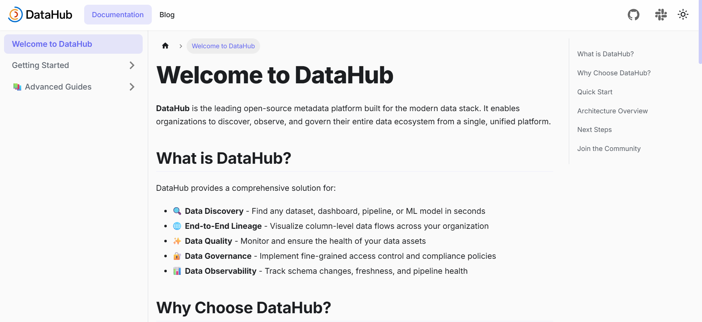

# DataHub Documentation

This repository contains the official documentation for DataHub, a modern data catalog built for teams to discover, understand, and trust their data.

The documentation is built with Docusaurus and deployed at https://datahub-docs-site.vercel.app.



## What You'll Find Here

- **Getting Started** - Quickstart guides and installation instructions
- **Architecture** - Deep dives into DataHub's design and components
- **User Guides** - Practical tutorials for data discovery, governance, and lineage
- **API Reference** - Technical documentation for developers
- **Best Practices** - Patterns and recommendations from the community

## Getting Started

### Prerequisites

- Node.js 20 or higher
- npm

### Running Locally

```bash
cd datahub-docs
npm install
npm start
```

The documentation site will be available at `http://localhost:3000`.

### Building for Production

```bash
npm run build
```

The static files will be generated in the `build` directory, ready for deployment.

## Contributing

Contributions are welcome! Whether you want to fix a typo, clarify an explanation, or add a new guide:

1. Fork the repository
2. Create a feature branch (`git checkout -b docs/your-improvement`)
3. Make your changes
4. Submit a pull request

Please see [CONTRIBUTING.md](docs/contributing.md) for detailed guidelines.

## License

MIT License - see the [LICENSE](LICENSE) file for details.
