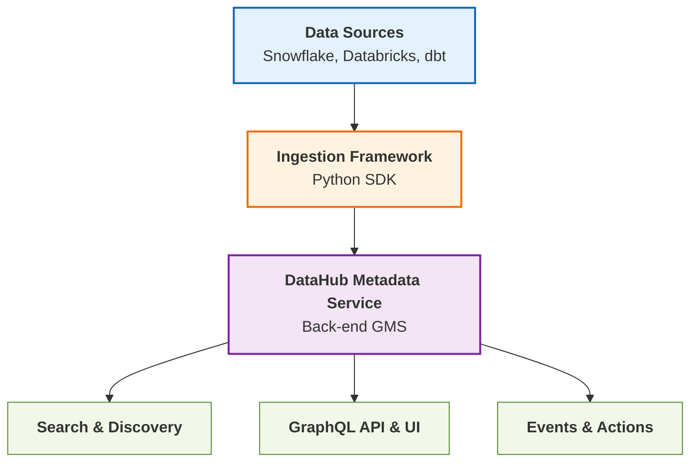

# Welcome to DataHub

**DataHub** is the leading open-source metadata platform built for the modern data stack. It enables organizations to discover, observe, and govern their entire data ecosystem from a single, unified platform.

## What is DataHub?

DataHub provides a comprehensive solution for:

- 🔍 **Data Discovery** - Find any dataset, dashboard, pipeline, or ML model in seconds
- 🌐 **End-to-End Lineage** - Visualize column-level data flows across your organization  
- ✨ **Data Quality** - Monitor and ensure the health of your data assets
- 🔐 **Data Governance** - Implement fine-grained access control and compliance policies
- 📊 **Data Observability** - Track schema changes, freshness, and pipeline health

## Why Choose DataHub?

| Feature | Description |
|---------|-------------|
| **100+ Integrations** | Connect to Snowflake, Databricks, dbt, Kafka, Airflow, and more |
| **Extensible Architecture** | Customize entities, relationships, and aspects via GraphQL API |
| **Real-time Ingestion** | Stream metadata changes with sub-second latency |
| **Enterprise Ready** | SSO, RBAC, audit logs, and SOC2 compliance |
| **Active Community** | 10K+ GitHub stars and 500+ contributors |

## Quick Start

Get DataHub running in minutes with Docker:

```bash
# Clone the repository
git clone https://github.com/datahub-project/datahub.git

# Start DataHub using Docker Compose
cd datahub/docker/quickstart
./quickstart.sh
```

Once started, access the DataHub UI at [http://localhost:9002](http://localhost:9002).

:::tip First Time Here?
Check out our [Getting Started Guide](/docs/category/tutorial-basics) for a comprehensive walkthrough of DataHub's core features.
:::

## Architecture Overview

DataHub is built on a flexible, event-driven architecture:



## Next Steps

<div className="row">
  <div className="col col--6">
    <div className="card margin-bottom--lg">
      <div className="card__header">
        <h3>📚 Learn the Basics</h3>
      </div>
      <div className="card__body">
        <p>Understand DataHub's core concepts including entities, aspects, and the metadata model.</p>
      </div>
      <div className="card__footer">
        <a className="button button--primary button--block" href="/docs/tutorial-basics/quick-installation">Core Concepts</a>
      </div>
    </div>
  </div>
  <div className="col col--6">
    <div className="card margin-bottom--lg">
      <div className="card__header">
        <h3>🔧 Set Up Ingestion</h3>
      </div>
      <div className="card__body">
        <p>Connect your data sources and start ingesting metadata automatically.</p>
      </div>
      <div className="card__footer">
        <a className="button button--primary button--block" href="/docs/tutorial-basics/ingestion-quickstart">Ingestion Guide</a>
      </div>
    </div>
  </div>
</div>

## Join the Community

- 💬 [Slack Community](https://slack.datahubproject.io) - Get help and discuss with the community
- 🐙 [GitHub Repository](https://github.com/datahub-project/datahub) - Report issues and contribute
- 📝 [Blog](https://blog.datahubproject.io) - Read about the latest features and best practices
- 🐦 [Twitter](https://twitter.com/databorating) - Follow for updates

---

Built with ❤️ by the DataHub community
