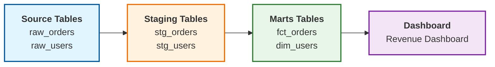
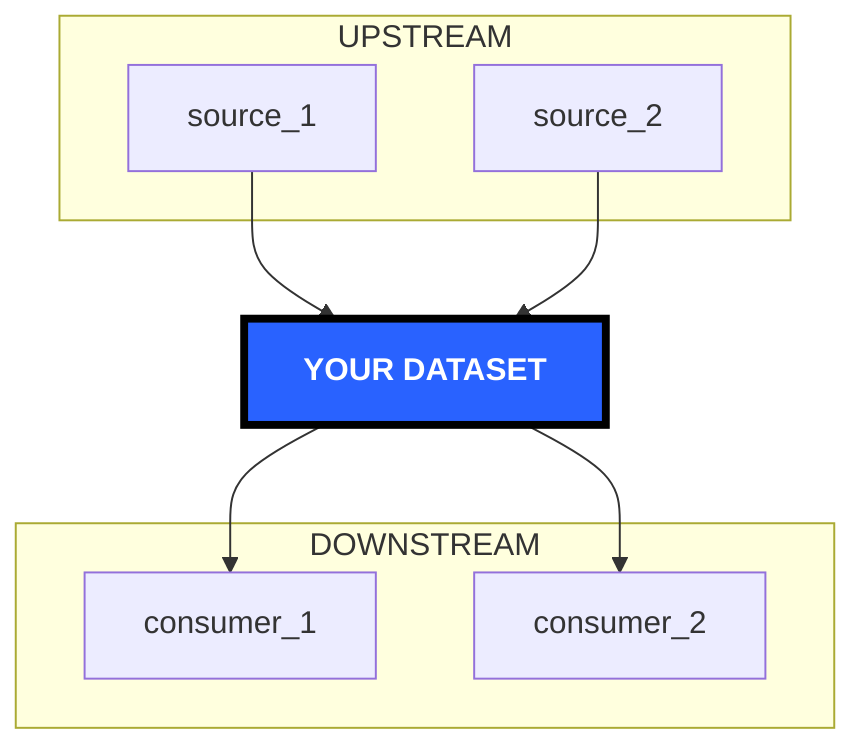
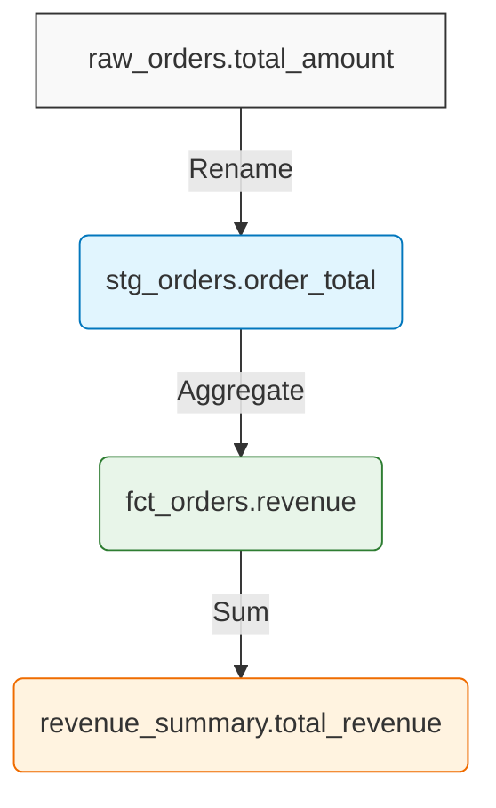
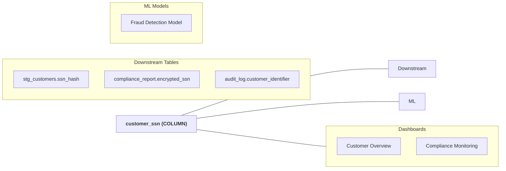

# Data Lineage 🌐

*"What happens if I change this table?"* — With lineage, you'll know exactly what breaks.

## What is Data Lineage?

Data lineage is like a family tree for your data. It shows:

- 🔼 **Where data comes from** (upstream dependencies)
- 🔽 **Where data goes** (downstream impact)
- 🔄 **How data transforms** along the way



## Why Lineage Matters

### 🔍 Impact Analysis

*"If I change the `customer_id` column in the source table, what breaks?"*

With lineage, you can see every dashboard, report, and ML model that depends on it — before you make the change.

### 🐛 Root Cause Analysis

*"This dashboard shows wrong numbers. Where did the problem start?"*

Trace backwards through lineage to find where bad data entered your pipeline.

### 📋 Compliance & Auditing

*"Show me everywhere this PII column is used."*

Critical for GDPR, CCPA, and internal data governance.

### 📈 Understanding Your Data

*"How is this table created? What business logic is applied?"*

Find the transformations that shape your data.

---

## Viewing Lineage

### Step 1: Navigate to Any Dataset

Search for a dataset and click to open its detail page.

### Step 2: Click the "Lineage" Tab

You'll see a beautiful, interactive graph:



### Step 3: Explore the Graph

- **Click nodes** to see details
- **Double-click** to navigate to that asset
- **Scroll** to zoom in/out
- **Drag** to pan around
- **Click edges** to see relationship details

---

## Lineage Depth Levels

### Dataset-Level Lineage

Shows which tables feed into which tables:

```
raw_orders → stg_orders → fct_orders → revenue_summary
```

### Column-Level Lineage

Column-level lineage provides a detailed view of how data flows through individual columns:



:::tip Why Column-Level Matters
When someone asks *"Where does the revenue number come from?"*, you can trace it back to the exact source column — through every transformation.
:::

---

## Lineage Sources

DataHub captures lineage from multiple places:

### 🏗️ dbt

When you ingest dbt, lineage is automatically captured from:
- `ref()` and `source()` calls in your models
- Dependencies defined in `manifest.json`

```sql
-- This automatically creates lineage!
SELECT * FROM {{ ref('stg_orders') }}
```

### 📊 SQL Parsing

DataHub understands SQL! When ingesting from warehouses, it parses:
- `CREATE TABLE ... AS SELECT`
- `INSERT INTO ... SELECT`
- View definitions

### 🔧 Airflow

If you use Airflow, the [datahub-airflow-plugin](https://github.com/datahub-project/datahub/tree/master/metadata-ingestion/src/datahub_provider) captures:
- Task dependencies
- Dataset reads and writes
- Execution metadata

### 📡 Real-Time Events

For streaming platforms like Kafka:
- Topic producers and consumers
- Flink/Spark streaming jobs

### ✏️ Manual Lineage

Don't have automatic lineage? Add it manually via UI or API:

```python
from datahub.emitter.mce_builder import make_lineage_mce

lineage = make_lineage_mce(
    upstream_urns=["urn:li:dataset:(urn:li:dataPlatform:snowflake,source_table,PROD)"],
    downstream_urn="urn:li:dataset:(urn:li:dataPlatform:snowflake,target_table,PROD)"
)
```

---

## Impact Analysis: The Killer Feature

This is where lineage becomes invaluable in production.

### Scenario: Dropping a Column

You need to remove `customer_ssn` from a table. Here's what lineage tells you:



**Now you know exactly who to notify before making the change!**

### How to Use Impact Analysis

1. Navigate to the asset you want to change
2. Click the **"Lineage"** tab
3. Look at **downstream** dependencies
4. Click **"Impact Analysis"** for a summary view
5. Export the list or share with stakeholders

---

## Lineage Visualization Options

### 📊 Graph View (Default)

Interactive node-and-edge visualization. Best for exploring relationships.

### 📋 List View

Tabular view of all upstream and downstream assets. Best for exporting or bulk analysis.

### 🔍 Focused View

Highlights a specific path through lineage. Useful when following one data flow.

### ⏱️ Time-Based View

See how lineage has changed over time. What was the lineage last month vs. today?

---

## Lineage Best Practices

### ✅ Do: Ingest Lineage Everywhere

The more sources you connect, the more complete your lineage picture:
- ✅ Ingest your warehouse (Snowflake, BigQuery)
- ✅ Ingest dbt
- ✅ Ingest Airflow
- ✅ Ingest BI tools (Tableau, Looker)

### ✅ Do: Enable Column-Level Lineage

It requires more processing but provides significantly more value:

```yaml
# In your ingestion recipe
source:
  type: snowflake
  config:
    include_column_lineage: true
```

### ✅ Do: Document Transformation Logic

When manually adding lineage, include a description:

```python
lineage = {
    "upstream": "source_table",
    "downstream": "target_table",
    "transformation": "SUM aggregation by customer_id, filtered to active customers only"
}
```

### ❌ Don't: Ignore Broken Lineage

If lineage is incomplete, investigate! Common causes:
- Missing ingestion for a source
- Dynamic SQL that can't be parsed
- External tools not integrated

---

## Troubleshooting Lineage

### "Why is there no lineage?"

**Check #1:** Was lineage extracted during ingestion?
```bash
# Look for lineage in ingestion output
datahub ingest -c recipe.yml 2>&1 | grep -i lineage
```

**Check #2:** Is `include_column_lineage` enabled for your source?

**Check #3:** Is the SQL parseable? Complex dynamic SQL may not be parsed correctly.

### "Lineage is incomplete"

Some sources may not support automatic lineage extraction. Consider:
- Adding a dbt layer for transformation lineage
- Using the Airflow plugin for pipeline lineage
- Adding manual lineage for gaps

### "Too many lineage hops"

By default, lineage shows 3 hops in each direction. Adjust in settings or use filters to focus on what matters.

---

## Real-World Example

### Tracing Revenue Discrepancy

**Problem:** The CFO reports that dashboard revenue doesn't match the financial system.

**Investigation with Lineage:**

1. **Start at the dashboard** → "Revenue Overview"
2. **Trace upstream** → Powered by `revenue_summary` table
3. **Trace further** → `revenue_summary` is built from `fct_orders`
4. **Trace further** → `fct_orders` comes from `stg_orders`
5. **Find the issue** → `stg_orders` filters out orders with status='pending'

**Root cause found:** The dashboard excludes pending orders, but the financial system includes them.

**Time to diagnosis:** 5 minutes instead of 5 hours of SQL archaeology.

---

## What's Next?

<div className="row">
  <div className="col col--6">
    <div className="card margin-bottom--lg">
      <div className="card__header">
        <h3>✨ Data Quality</h3>
      </div>
      <div className="card__body">
        <p>Set up assertions and monitor data freshness.</p>
      </div>
      <div className="card__footer">
        <a className="button button--primary button--block" href="/docs/tutorial-basics/data-quality">Monitor Quality →</a>
      </div>
    </div>
  </div>
  <div className="col col--6">
    <div className="card margin-bottom--lg">
      <div className="card__header">
        <h3>🔐 Data Governance</h3>
      </div>
      <div className="card__body">
        <p>Implement access controls and compliance policies.</p>
      </div>
      <div className="card__footer">
        <a className="button button--primary button--block" href="/docs/tutorial-basics/governance">Set Up Governance →</a>
      </div>
    </div>
  </div>
</div>
