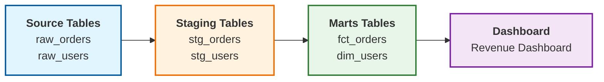
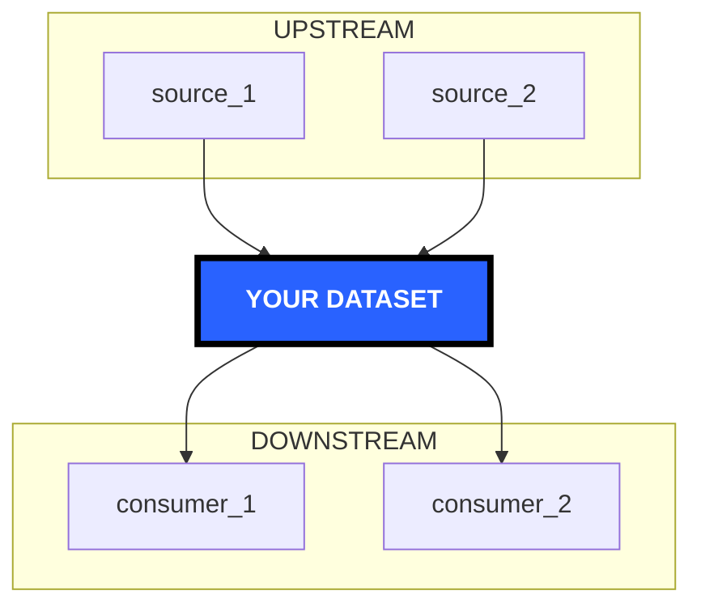
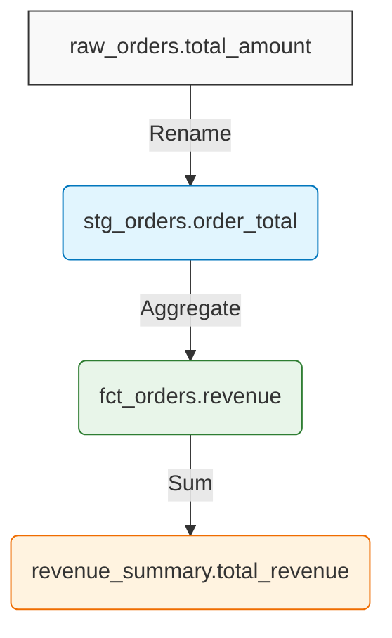
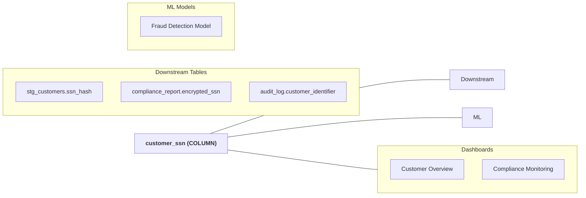

# Data Lineage

You know that feeling when someone asks "hey, can we drop this column?" and you have no idea what'll break? That's what lineage solves.

## What you're looking at

Data lineage tracks how data moves through your systems. It's basically a dependency graph for your tables, columns, and everything that uses them.

You get three things:
- Where data comes from (upstream)
- Where it goes (downstream)  
- What happens to it along the way


## Why this matters

**Impact analysis**: Before you change a column, you'll see every dashboard, report, and ML model that depends on it. No more "oops, I broke prod."

**Debugging**: Dashboard showing wrong numbers? Trace backwards to find where the bad data started instead of pinging six teams on Slack.

**Compliance**: Need to find everywhere a PII column is used for GDPR? Done. Export the list and hand it to legal.

**Understanding legacy stuff**: When you inherit a pipeline and need to figure out what it actually does, lineage is your map.

## How to use it

Find a dataset and click the "Lineage" tab. You'll get an interactive graph that shows everything connected to it.


Click nodes to see details. Double-click to navigate. Scroll to zoom. It's basically what you'd expect.

## Granularity levels

### Dataset-level

Shows which tables feed into which:
```
raw_orders → stg_orders → fct_orders → revenue_summary
```

This is fine for most cases. You can see the flow without getting overwhelmed.

### Column-level

This is where it gets useful. You can trace individual columns through transformations:


When someone asks "where does this revenue number come from?", you can trace it back to the exact source column. Way better than grepping through SQL files.

## Where lineage comes from

DataHub picks up lineage from a bunch of places.

### dbt

Automatically captured from `ref()` and `source()` calls:
```sql
SELECT * FROM {{ ref('stg_orders') }}
```

It just works. The lineage is already in your manifest.

### SQL parsing

DataHub can parse SQL from your warehouse. It understands `CREATE TABLE AS`, `INSERT INTO`, view definitions, all that. Not perfect for complex dynamic SQL, but catches most stuff.

### Airflow

The [datahub-airflow-plugin](https://github.com/datahub-project/datahub/tree/master/metadata-ingestion/src/datahub_provider) grabs task dependencies and dataset operations. You'll see your DAG structure reflected in lineage.

### Streaming platforms

For Kafka, Flink, Spark streaming - topic producers, consumers, the whole flow.

### Manual entry

Sometimes automatic lineage isn't an option. You can add it yourself:
```python
from datahub.emitter.mce_builder import make_lineage_mce

lineage = make_lineage_mce(
    upstream_urns=["urn:li:dataset:(urn:li:dataPlatform:snowflake,source_table,PROD)"],
    downstream_urn="urn:li:dataset:(urn:li:dataPlatform:snowflake,target_table,PROD)"
)
```

Not ideal, but it works.

## Impact analysis in practice

Here's the real use case: you need to drop `customer_ssn` from a table. Lineage shows you:


Now you know who to email before making the change. You can even export the list.

Go to the asset, click "Lineage", look at downstream dependencies. There's an "Impact Analysis" button that gives you a summary view.

## Different views

**Graph view**: The default interactive thing. Good for exploring.

**List view**: Tabular format. Better for exporting or when you need to analyze a lot at once.

**Focused view**: Highlights a specific path. Useful when you're following one particular flow and don't want the noise.

**Time-based view**: See how lineage changed over time. What was it last month vs today? Honestly haven't used this much but it's there.

## Getting lineage right

Connect as many sources as you can. The more you ingest, the more complete your lineage:
- Your warehouse
- dbt
- Airflow  
- BI tools

Enable column-level lineage if you can. It takes more processing time but you'll actually use it:
```yaml
source:
  type: snowflake
  config:
    include_column_lineage: true
```

When adding manual lineage, document what's happening:
```python
lineage = {
    "upstream": "source_table",
    "downstream": "target_table",
    "transformation": "SUM aggregation by customer_id, filtered to active customers only"
}
```

If lineage is incomplete, figure out why. Usually it's a missing ingestion source, unparseable dynamic SQL, or some external tool that's not integrated.

## When lineage is broken

**No lineage at all?**

Check if it was extracted during ingestion:
```bash
datahub ingest -c recipe.yml 2>&1 | grep -i lineage
```

Make sure `include_column_lineage` is enabled. Check if your SQL is too complex to parse.

**Incomplete lineage?**

Some sources just don't support automatic extraction. You might need to add a dbt layer, use the Airflow plugin, or fill gaps manually.

**Too many hops?**

Default is 3 hops each direction. You can adjust this or use filters to focus on what matters.

## Real example

The CFO says dashboard revenue doesn't match the financial system. Here's how you'd trace it:

Start at "Revenue Overview" dashboard → it uses `revenue_summary` table → which comes from `fct_orders` → which comes from `stg_orders` → ah, `stg_orders` filters out pending orders.

That's the issue. Dashboard excludes pending, financial system includes them.

Five minutes instead of five hours of digging through SQL. That's the point.

## What's next

<div className="row">
  <div className="col col--6">
    <div className="card margin-bottom--lg">
      <div className="card__header">
        <h3>Data Quality</h3>
      </div>
      <div className="card__body">
        <p>Set up assertions and monitor data freshness.</p>
      </div>
      <div className="card__footer">
        <a className="button button--primary button--block" href="/docs/tutorial-basics/data-quality">Monitor Quality →</a>
      </div>
    </div>
  </div>
  <div className="col col--6">
    <div className="card margin-bottom--lg">
      <div className="card__header">
        <h3>Data Governance</h3>
      </div>
      <div className="card__body">
        <p>Implement access controls and compliance policies.</p>
      </div>
      <div className="card__footer">
        <a className="button button--primary button--block" href="/docs/tutorial-basics/governance">Set Up Governance →</a>
      </div>
    </div>
  </div>
</div>