# Data Quality & Observability

Bad data causes real problems. Executives make decisions based on wrong numbers. Teams stop trusting dashboards. Engineers spend hours debugging pipeline issues. Sometimes there are compliance implications.

DataHub helps you catch this stuff before it reaches anyone important.

## What you're monitoring

Three main things:

**Freshness**: Is the data up to date?
```
Expected: Updates every 6 hours
Actual: Last update 18 hours ago
Status: Stale
```

**Quality**: Is the data correct?
```
Assertion: revenue should be > 0
Check: Found 1,247 rows with revenue = 0
Status: Failing
```

**Schema**: Has the structure changed?
```
Change: Column 'customer_ssn' removed
Impact: 3 downstream tables affected
Status: Alert sent
```

## Setting up freshness checks

Freshness monitoring tells you when data was last updated.

### Add a freshness assertion

1. Search for your table
2. Go to the "Health" or "Quality" tab
3. Click "Add Assertion" → "Freshness"

Configure it:
```yaml
Freshness Rule:
  Schedule: "Data should update every 6 hours"
  Grace Period: "1 hour"
  Notification: "Slack #data-alerts"
```

You'll see a timeline of when checks passed or failed:

```mermaid
graph TD
    subgraph History
        D1[Feb 11<br/>✅ Fresh] --> D2[Feb 12<br/>⚠️ Stale]
        D2 --> D3[Feb 13<br/>✅ Fresh]
        D3 --> D4[Feb 14<br/>✅ Fresh]
        D4 --> D5[Feb 15<br/>✅ Fresh]
    end

    Status["<b>Current Status</b><br/>✅ HEALTHY<br/>Last checked: 5 min ago"]

    style D1 fill:#e8f5e9,stroke:#2e7d32,stroke-width:2px
    style D2 fill:#fff3e0,stroke:#ef6c00,stroke-width:2px
    style D3 fill:#e8f5e9,stroke:#2e7d32,stroke-width:2px
    style D4 fill:#e8f5e9,stroke:#2e7d32,stroke-width:2px
    style D5 fill:#e8f5e9,stroke:#2e7d32,stroke-width:2px
    
    style Status fill:#e3f2fd,stroke:#1565c0,stroke-width:2px,stroke-dasharray: 5 5
```


## Quality assertions

Assertions are rules your data needs to follow. They fail, you get notified.

### Common types

**Volume checks** - did we get the expected amount of data?
```yaml
assertion:
  type: volume
  rule: "Row count should be > 1,000,000"
  table: "analytics.daily_events"
  schedule: "0 6 * * *"
```

**Column checks** - are values valid?
```yaml
assertion:
  type: column
  column: "email"
  rules:
    - "Should not be null"
    - "Should match regex: ^[a-zA-Z0-9+_.-]+@[a-zA-Z0-9.-]+$"
    - "Should be unique"
```

**Custom SQL** - run any validation query
```yaml
assertion:
  type: sql
  query: |
    SELECT COUNT(*) as failed_rows
    FROM orders
    WHERE total_amount < 0
  expectation: "failed_rows should be 0"
```

## Creating assertions in the UI

Go to any dataset and click the "Assertions" tab. Click "Create Assertion" and pick a type:

| Type | Use Case |
|------|----------|
| **Freshness** | "Table should update every X hours" |
| **Volume** | "Should have at least X rows" |  
| **Column** | "Column should not have nulls" |
| **Custom SQL** | "Any custom validation" |

Fill in the parameters:


Click "Run Now" to test it immediately.

## Assertions as code

If you prefer infrastructure-as-code, define assertions in YAML:
```yaml
assertions:
  - entity: "urn:li:dataset:(urn:li:dataPlatform:snowflake,analytics.orders,PROD)"
    assertions:
      - type: freshness
        schedule:
          cron: "0 */6 * * *"
        parameters:
          maxStalenessHours: 8
        notification:
          channel: slack
          target: "#data-alerts"
      
      - type: column_values
        column: "order_total"
        parameters:
          operator: "GREATER_THAN"
          value: 0
          maxFailPercentage: 0.1
      
      - type: volume
        parameters:
          operator: "GREATER_THAN"
          value: 100000
```

Apply with:
```bash
datahub assertions apply -f assertions.yml
```

## Data contracts

Data contracts are formal agreements about what data should look like. They bundle multiple assertions together.
```yaml
dataContract:
  entity: "urn:li:dataset:(urn:li:dataPlatform:snowflake,analytics.customers,PROD)"
  
  schema:
    fields:
      - name: customer_id
        type: STRING
        required: true
        description: "Unique customer identifier"
      - name: email
        type: STRING
        required: true
        pii: true
      - name: created_at
        type: TIMESTAMP
        required: true
  
  freshness:
    maxStalenessHours: 24
  
  quality:
    assertions:
      - type: no_nulls
        columns: [customer_id, email]
      - type: unique
        columns: [customer_id]
      - type: custom_sql
        query: "SELECT COUNT(*) FROM customers WHERE email NOT LIKE '%@%'"
        expectation: "equals 0"
  
  owners:
    - team: data-engineering
    - person: sarah@company.com
```

Contract statuses:

| Status | Meaning |
|--------|---------|
| Passing | All assertions pass |
| Warning | Some non-critical assertions failing |
| Failing | Critical assertions failing |
| Unknown | Assertions haven't run yet |

## Schema change detection

DataHub tracks schema changes automatically.

What gets monitored:
- New columns added
- Columns removed
- Column types changed
- Column descriptions updated

Go to any dataset → "Schema" tab → "History" to see changes over time:


Get notified when schemas change:
```yaml
notification:
  trigger: schema_change
  entity: "urn:li:dataset:(urn:li:dataPlatform:snowflake,analytics.*,PROD)"
  channel: slack
  target: "#schema-changes"
  include:
    - column_added
    - column_removed
    - type_changed
```

## Notifications

Set up alerts so you don't have to watch dashboards all day.

### Slack
```yaml
notifications:
  slack:
    webhook_url: "https://hooks.slack.com/services/YOUR/WEBHOOK/URL"
    default_channel: "#data-alerts"
    
    channels:
      critical: "#data-critical"
      warning: "#data-warnings"
      info: "#data-updates"
```

### Email
```yaml
notifications:
  email:
    smtp_server: "smtp.company.com"
    from: "datahub@company.com"
    recipients:
      - "data-team@company.com"
      - "on-call@company.com"
```

What you'll get:

```mermaid
graph LR
    A["<b>🚨 ALERT TRIGGERED</b><br/>Assertion Failed"] 
    --> B["<b>Dataset</b><br/>analytics.orders"]
    --> C["<b>Details</b><br/>Freshness: 14h ago<br/>Exp: 6h ago"]
    --> D["<b>Impact</b><br/>5 dashboards<br/>2 ML models"]

    style A fill:#ffebee,stroke:#c62828,stroke-width:2px,color:#b71c1c
    style B fill:#e3f2fd,stroke:#1565c0,stroke-width:2px
    style C fill:#fff3e0,stroke:#ef6c00,stroke-width:2px
    style D fill:#f3e5f5,stroke:#7b1fa2,stroke-width:2px
```


## Health dashboard

Overview of everything:


Recent failures:

```mermaid
graph TD
    subgraph Recent Failures
        A[❌ analytics.revenue_summary] -->|Freshness| T1(2h ago)
        B[❌ marketing.campaigns] -->|Volume| T2(5h ago)
        C[❌ staging.raw_events] -->|Schema| T3(1d ago)
    end
    
    style A stroke:#f00,stroke-width:2px
    style B stroke:#f00,stroke-width:2px
    style C stroke:#f00,stroke-width:2px
```


## How to not screw this up

**Start small**: Don't monitor everything at once. Pick your most critical tables, add freshness checks first (easiest to set up), then expand.

**Be realistic with SLAs**: "Data must update every 5 minutes" will create alert fatigue. "Data should update every 6 hours with 1 hour grace period" accounts for normal delays.

**Use warning vs. critical**:
```yaml
freshness:
  warning_threshold_hours: 6   # Alert
  critical_threshold_hours: 12 # Page on-call
```

**Document your assertions**: Future you will need to know why this exists.
```yaml
assertion:
  type: column_values
  column: "order_status"
  rule: "should be in ['pending', 'completed', 'cancelled', 'refunded']"
  description: "Order status must be one of the valid statuses from the OMS system enum. Added to prevent dashboard rendering issues caused by unknown status values."
```

## What's next

<div className="row">
  <div className="col col--6">
    <div className="card margin-bottom--lg">
      <div className="card__header">
        <h3>Data Governance</h3>
      </div>
      <div className="card__body">
        <p>Control access and ensure compliance.</p>
      </div>
      <div className="card__footer">
        <a className="button button--primary button--block" href="/docs/tutorial-basics/governance">Set Up Governance →</a>
      </div>
    </div>
  </div>
  <div className="col col--6">
    <div className="card margin-bottom--lg">
      <div className="card__header">
        <h3>Tags & Glossary</h3>
      </div>
      <div className="card__body">
        <p>Organize data with business-friendly terms.</p>
      </div>
      <div className="card__footer">
        <a className="button button--primary button--block" href="/docs/tutorial-basics/tags-glossary">Get Organized →</a>
      </div>
    </div>
  </div>
</div>