# Data Quality & Observability ✨

*"Is the data fresh? Is it accurate?"* These questions are critical for any data-driven organization. DataHub provides the tools to monitor and guarantee data health.

## The Data Quality Problem

Bad data can lead to significant operational costs and lost productivity.

| Impact | Description |
|--------|-------------|
| **Wrong Decisions** | Executives make choices based on incorrect numbers |
| **Lost Trust** | Teams stop trusting your dashboards |
| **Wasted Time** | Engineers spend hours debugging data issues |
| **Compliance Risk** | Incorrect reporting can have legal consequences |

DataHub helps you catch problems **before** they reach stakeholders.

---

## The Three Pillars of Data Observability

### 1️⃣ Freshness

*Is my data up to date?*

```
Expected: Data updates every 6 hours
Actual: Last update was 18 hours ago
Status: ⚠️ STALE
```

### 2️⃣ Quality

*Is my data correct?*

```
Assertion: revenue should be > 0
Check: Found 1,247 rows with revenue = 0
Status: ❌ FAILING
```

### 3️⃣ Schema

*Has my data structure changed?*

```
Change detected: Column 'customer_ssn' was removed
Impact: 3 downstream tables affected
Status: 🔔 ALERT
```

---

## Setting Up Freshness Monitoring

Freshness tells you when data was last updated. Here's how to set it up:

### Step 1: Navigate to Your Dataset

Search for the table you want to monitor.

### Step 2: Open the Health Tab

Click on the **"Health"** or **"Quality"** tab.

### Step 3: Add a Freshness Assertion

Click **"Add Assertion"** → **"Freshness"**

Configure the expectation:

```yaml
Freshness Rule:
  Schedule: "Data should update every 6 hours"
  Grace Period: "1 hour"
  Notification: "Slack #data-alerts"
```

### What It Looks Like in Action

```mermaid
graph TD
    subgraph History
        D1[Feb 11<br/>✅ Fresh] --> D2[Feb 12<br/>⚠️ Stale]
        D2 --> D3[Feb 13<br/>✅ Fresh]
        D3 --> D4[Feb 14<br/>✅ Fresh]
        D4 --> D5[Feb 15<br/>✅ Fresh]
    end

    Status["<b>Current Status</b><br/>✅ HEALTHY<br/>Last checked: 5 min ago"]

    style D1 fill:#e8f5e9,stroke:#2e7d32,stroke-width:2px
    style D2 fill:#fff3e0,stroke:#ef6c00,stroke-width:2px
    style D3 fill:#e8f5e9,stroke:#2e7d32,stroke-width:2px
    style D4 fill:#e8f5e9,stroke:#2e7d32,stroke-width:2px
    style D5 fill:#e8f5e9,stroke:#2e7d32,stroke-width:2px
    
    style Status fill:#e3f2fd,stroke:#1565c0,stroke-width:2px,stroke-dasharray: 5 5
```



---

## Creating Data Quality Assertions

Assertions are rules that your data must follow. When they fail, you get notified.

### Common Assertion Types

#### Volume Assertions

*"Did we get the expected amount of data?"*

```yaml
assertion:
  type: volume
  rule: "Row count should be > 1,000,000"
  table: "analytics.daily_events"
  schedule: "0 6 * * *"  # Every day at 6 AM
```

#### Column Assertions

*"Are the values in this column valid?"*

```yaml
assertion:
  type: column
  column: "email"
  rules:
    - "Should not be null"
    - "Should match regex: ^[a-zA-Z0-9+_.-]+@[a-zA-Z0-9.-]+$"
    - "Should be unique"
```

#### Custom SQL Assertions

*"Run any SQL to validate data"*

```yaml
assertion:
  type: sql
  query: |
    SELECT COUNT(*) as failed_rows
    FROM orders
    WHERE total_amount < 0
  expectation: "failed_rows should be 0"
```

---

## Creating Assertions via UI

### Step 1: Go to Assertions Tab

On any dataset, click **"Assertions"** tab.

### Step 2: Click "Create Assertion"

Choose your assertion type:

| Type | Use Case |
|------|----------|
| **Freshness** | "Table should update every X hours" |
| **Volume** | "Should have at least X rows" |  
| **Column** | "Column should not have nulls" |
| **Custom SQL** | "Any custom validation" |

### Step 3: Configure the Rule

Fill in the parameters:


### Step 4: Run the Assertion

Click **"Run Now"** to test immediately, or wait for the scheduled run.

---

## Creating Assertions via CLI/API

For infrastructure-as-code enthusiasts, define assertions in YAML:

```yaml
# assertions.yml
assertions:
  - entity: "urn:li:dataset:(urn:li:dataPlatform:snowflake,analytics.orders,PROD)"
    assertions:
      - type: freshness
        schedule:
          cron: "0 */6 * * *"  # Every 6 hours
        parameters:
          maxStalenessHours: 8
        notification:
          channel: slack
          target: "#data-alerts"
      
      - type: column_values
        column: "order_total"
        parameters:
          operator: "GREATER_THAN"
          value: 0
          maxFailPercentage: 0.1  # Allow 0.1% failure rate
      
      - type: volume
        parameters:
          operator: "GREATER_THAN"
          value: 100000
```

Apply with:

```bash
datahub assertions apply -f assertions.yml
```

---

## Data Contracts 📜

Data contracts are formal agreements about what data should look like. They combine multiple assertions into a single, enforceable contract.

### Creating a Data Contract

```yaml
# contract.yml
dataContract:
  entity: "urn:li:dataset:(urn:li:dataPlatform:snowflake,analytics.customers,PROD)"
  
  schema:
    fields:
      - name: customer_id
        type: STRING
        required: true
        description: "Unique customer identifier"
      - name: email
        type: STRING
        required: true
        pii: true
      - name: created_at
        type: TIMESTAMP
        required: true
  
  freshness:
    maxStalenessHours: 24
  
  quality:
    assertions:
      - type: no_nulls
        columns: [customer_id, email]
      - type: unique
        columns: [customer_id]
      - type: custom_sql
        query: "SELECT COUNT(*) FROM customers WHERE email NOT LIKE '%@%'"
        expectation: "equals 0"
  
  owners:
    - team: data-engineering
    - person: sarah@company.com
```

### Contract Statuses

| Status | Meaning |
|--------|---------|
| ✅ **Passing** | All assertions pass, data is healthy |
| ⚠️ **Warning** | Some non-critical assertions failing |
| ❌ **Failing** | Critical assertions failing, data is unreliable |
| 🔄 **Unknown** | Assertions haven't run yet |

---

## Schema Change Detection

DataHub automatically tracks schema changes over time.

### What's Monitored

- ➕ New columns added
- ➖ Columns removed
- 🔄 Column types changed
- 📝 Column descriptions updated

### Viewing Schema History

1. Navigate to your dataset
2. Click **"Schema"** tab
3. Click **"History"** to see changes over time


### Schema Change Alerts

Get notified when schemas change:

```yaml
notification:
  trigger: schema_change
  entity: "urn:li:dataset:(urn:li:dataPlatform:snowflake,analytics.*,PROD)"
  channel: slack
  target: "#schema-changes"
  include:
    - column_added
    - column_removed
    - type_changed
```

---

## Setting Up Notifications

Don't stare at dashboards all day. Let DataHub notify you!

### Slack Integration

```yaml
# In your DataHub config
notifications:
  slack:
    webhook_url: "https://hooks.slack.com/services/YOUR/WEBHOOK/URL"
    default_channel: "#data-alerts"
    
    # Different channels for different severity
    channels:
      critical: "#data-critical"
      warning: "#data-warnings"
      info: "#data-updates"
```

### Email Notifications

```yaml
notifications:
  email:
    smtp_server: "smtp.company.com"
    from: "datahub@company.com"
    recipients:
      - "data-team@company.com"
      - "on-call@company.com"
```

### What You'll Receive

```mermaid
graph LR
    A["<b>🚨 ALERT TRIGGERED</b><br/>Assertion Failed"] 
    --> B["<b>Dataset</b><br/>analytics.orders"]
    --> C["<b>Details</b><br/>Freshness: 14h ago<br/>Exp: 6h ago"]
    --> D["<b>Impact</b><br/>5 dashboards<br/>2 ML models"]

    style A fill:#ffebee,stroke:#c62828,stroke-width:2px,color:#b71c1c
    style B fill:#e3f2fd,stroke:#1565c0,stroke-width:2px
    style C fill:#fff3e0,stroke:#ef6c00,stroke-width:2px
    style D fill:#f3e5f5,stroke:#7b1fa2,stroke-width:2px
```



---

## The Data Health Dashboard


```


```

---

## Best Practices

### ✅ Start Small

Don't try to monitor everything at once. Start with:
1. Your most critical tables
2. Freshness checks (easiest to set up)
3. Then expand to quality assertions

### ✅ Set Realistic SLAs

```
❌ Bad: "Data must update every 5 minutes"
   (Will create alert fatigue)

✅ Good: "Data should update every 6 hours, with 1 hour grace period"
   (Accounts for normal delays)
```

### ✅ Use Warning vs. Critical

Not all failures are equal:

```yaml
freshness:
  warning_threshold_hours: 6   # ⚠️ Alert
  critical_threshold_hours: 12 # ❌ Page on-call
```

### ✅ Document Your Assertions

Future you will thank present you:

```yaml
assertion:
  type: column_values
  column: "order_status"
  rule: "should be in ['pending', 'completed', 'cancelled', 'refunded']"
  description: "Order status must be one of the valid statuses from the OMS system enum. Added to prevent dashboard rendering issues caused by unknown status values."
```

---

## What's Next?

<div className="row">
  <div className="col col--6">
    <div className="card margin-bottom--lg">
      <div className="card__header">
        <h3>🔐 Data Governance</h3>
      </div>
      <div className="card__body">
        <p>Control access and ensure compliance.</p>
      </div>
      <div className="card__footer">
        <a className="button button--primary button--block" href="/docs/tutorial-basics/governance">Set Up Governance →</a>
      </div>
    </div>
  </div>
  <div className="col col--6">
    <div className="card margin-bottom--lg">
      <div className="card__header">
        <h3>🏷️ Tags & Glossary</h3>
      </div>
      <div className="card__body">
        <p>Organize data with business-friendly terms.</p>
      </div>
      <div className="card__footer">
        <a className="button button--primary button--block" href="/docs/tutorial-basics/tags-glossary">Get Organized →</a>
      </div>
    </div>
  </div>
</div>
