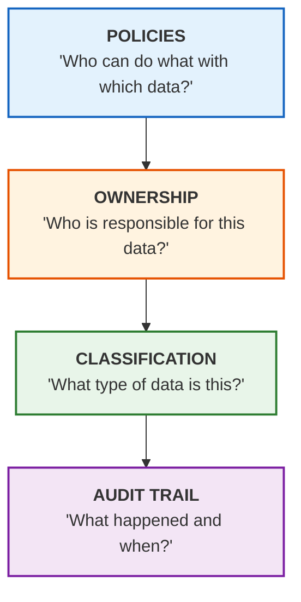
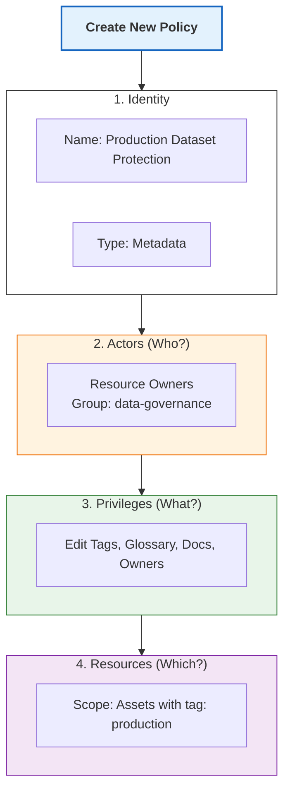
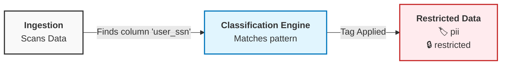
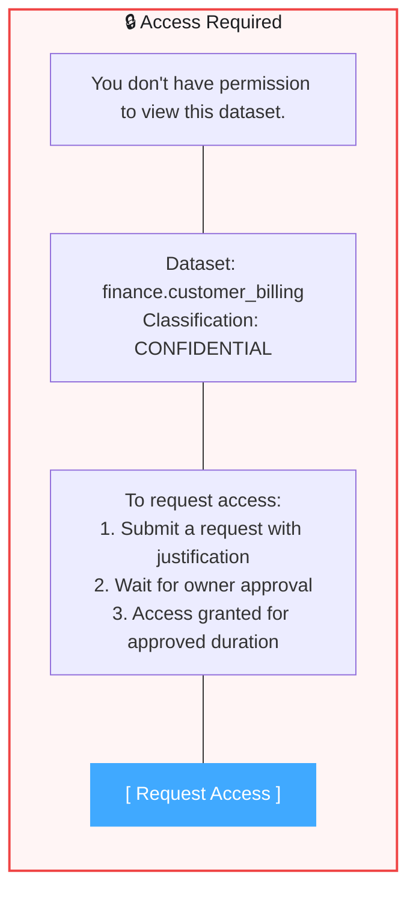
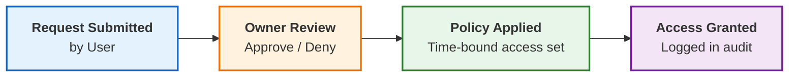
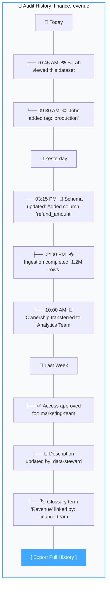
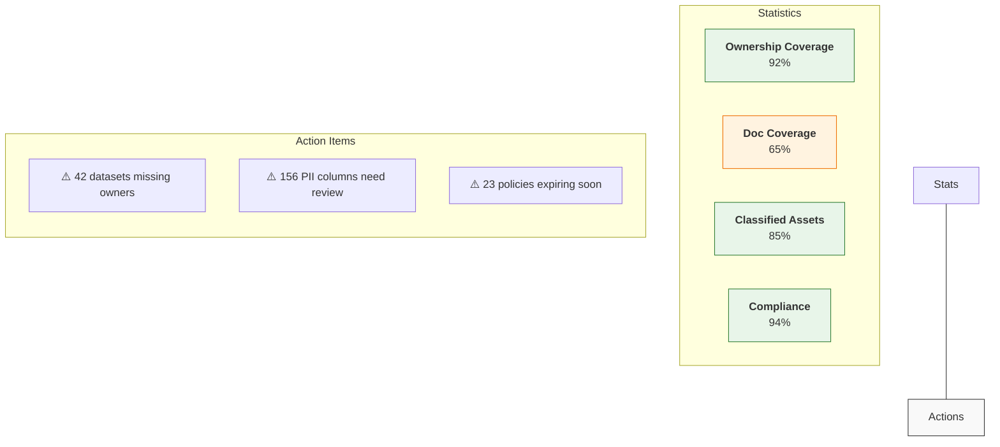

# Data Governance 🔐

*"Who can see this data? Who approved access?"* — Let's build a governance framework that answers these questions automatically.

## Why Governance Matters

| Without Governance | With Governance |
|-------------------|-----------------|
| Anyone can access any data | Role-based access control |
| No audit trail | Complete access history |
| Manual compliance checks | Automated policy enforcement |
| PII scattered everywhere | Automatic data classification |

---

## The Governance Stack

DataHub provides multiple layers of governance:



---

## Ownership: Who's Responsible?

Every dataset should have clearly defined owners to ensure accountability.

### Types of Ownership

| Type | Responsibility |
|------|----------------|
| **Technical Owner** | Maintains the pipeline, fixes data issues |
| **Business Owner** | Defines requirements, approves access |
| **Steward** | Ensures data quality and documentation |

### Assigning Owners

#### Via UI

1. Open any dataset
2. Click **"+ Add Owner"**
3. Search for a person or team
4. Select ownership type

#### Via Ingestion

Add owners to your ingestion recipe:

```yaml
source:
  type: snowflake
  config:
    # ... connection config ...
    
transformers:
  - type: "pattern_add_dataset_ownership"
    config:
      owner_pattern:
        rules:
          # Analytics schema owned by analytics team
          ".*analytics.*":
            - owner: "urn:li:corpuser:analytics-team@company.com"
              type: "DATAOWNER"
          
          # Finance tables owned by finance
          ".*finance.*":
            - owner: "urn:li:corpuser:finance-data@company.com"
              type: "BUSINESS_OWNER"
```

#### Via dbt

```yaml
# dbt schema.yml
models:
  - name: revenue_summary
    meta:
      datahub:
        owners:
          - id: analytics-team@company.com
            type: DATAOWNER
          - id: cfo@company.com
            type: BUSINESS_OWNER
```

### Ownership Best Practices

:::tip The Rule of Two
Every dataset should have at least:
1. A **Technical Owner** who can fix it
2. A **Business Owner** who can answer questions about it
:::

---

## Access Policies: Fine-Grained Control

Policies control who can view, edit, or access assets.

### Policy Types

| Type | Controls |
|------|----------|
| **Metadata Policies** | Who can edit tags, descriptions, ownership |
| **Platform Policies** | Who can manage DataHub settings, ingestion |
| **Access Policies** | Who can view/access the underlying data |

### Creating a Metadata Policy

#### Example: Only owners can edit production datasets

```yaml
policy:
  name: "Production Dataset Protection"
  type: METADATA
  state: ACTIVE
  
  # Who does this apply to?
  actors:
    resourceOwners: true    # Owners can edit
    users: []               # No specific users (use groups instead)
    groups:
      - "urn:li:corpGroup:data-governance"  # Governance team too
  
  # What actions are allowed?
  privileges:
    - EDIT_ENTITY_TAGS
    - EDIT_ENTITY_GLOSSARY_TERMS
    - EDIT_ENTITY_DOCS
    - EDIT_ENTITY_OWNERS
  
  # Which resources?
  resources:
    filter:
      criteria:
        - field: "tag"
          values: ["urn:li:tag:production"]
          condition: EQUALS
```

### Creating via UI

1. Go to **Settings** → **Policies**
2. Click **"Create Policy"**
3. Configure actors, privileges, and resources



### Common Policy Patterns

#### Pattern 1: Self-Service for Teams

Each team manages their own domain:

```yaml
policies:
  - name: "Marketing Team Self-Service"
    actors:
      groups: ["marketing-data"]
    privileges: [EDIT_ENTITY_TAGS, EDIT_ENTITY_DOCS, EDIT_ENTITY_OWNERS]
    resources:
      domains: ["marketing"]
  
  - name: "Finance Team Self-Service"
    actors:
      groups: ["finance-data"]
    privileges: [EDIT_ENTITY_TAGS, EDIT_ENTITY_DOCS, EDIT_ENTITY_OWNERS]
    resources:
      domains: ["finance"]
```

#### Pattern 2: PII Lockdown

Only approved individuals can see PII:

```yaml
policy:
  name: "PII Visibility Restriction"
  type: METADATA
  actors:
    groups: ["pii-approved"]
  privileges: [VIEW_ENTITY]
  resources:
    filter:
      criteria:
        - field: "tag"
          values: ["urn:li:tag:pii"]
          condition: EQUALS
```

#### Pattern 3: Read-Only for Analysts

Analysts can view but not modify:

```yaml
policy:
  name: "Analyst Read-Only Access"
  actors:
    groups: ["analysts"]
  privileges: 
    - VIEW_ENTITY
    - VIEW_ENTITY_PAGE
  resources:
    type: ALL
```

---

## Data Classification

Automatically classify data based on content patterns.

### Classification Types

| Level | Description | Example |
|-------|-------------|---------|
| **Public** | Can be shared freely | Marketing materials |
| **Internal** | Company-wide access | Employee directory |
| **Confidential** | Need-to-know basis | Revenue data |
| **Restricted** | Heavily controlled | PII, financial records |

### Automatic Classification

DataHub can automatically detect and tag sensitive data:

```yaml
# classification_config.yml
classification:
  enabled: true
  
  patterns:
    - name: "Social Security Number"
      regex: "\\b\\d{3}-\\d{2}-\\d{4}\\b"
      tag: "pii"
      classification: "RESTRICTED"
    
    - name: "Email Address"
      regex: "^[\\w.-]+@[\\w.-]+\\.[a-zA-Z]{2,}$"
      tag: "pii"
      classification: "CONFIDENTIAL"
    
    - name: "Credit Card"
      regex: "\\b\\d{4}[- ]?\\d{4}[- ]?\\d{4}[- ]?\\d{4}\\b"
      tag: "pii"
      classification: "RESTRICTED"
  
  column_patterns:
    - name: "PII Column Names"
      columns:
        - "*ssn*"
        - "*social_security*"
        - "*email*"
        - "*phone*"
        - "*address*"
        - "*credit_card*"
      tag: "pii"
```

### Classification Workflow



---

## Access Requests & Workflows

For sensitive data, implement an approval workflow.

### Requesting Access

When a user tries to access restricted data:



### Approval Flow



---

## Audit Trail: Complete History

Every action in DataHub is logged.

### What's Tracked

- ✅ Who viewed an asset
- ✅ Who edited metadata
- ✅ Who changed ownership
- ✅ Who approved access requests
- ✅ Schema changes and when they happened
- ✅ Ingestion runs and their status

### Viewing Audit History

1. Open any dataset
2. Click **"History"** tab
3. See complete timeline



### Exporting for Compliance

For SOC2, GDPR, or other audits:

```bash
# Export audit logs for a specific time range
datahub audit export \
  --start-date 2024-01-01 \
  --end-date 2024-03-31 \
  --format csv \
  --output q1_audit.csv
```

---

## Compliance Frameworks

### GDPR Compliance

| Requirement | DataHub Solution |
|-------------|-----------------|
| Data inventory | Search by `tag:pii` |
| Right to erasure | Lineage shows all PII locations |
| Data minimization | Quality rules enforce data retention |
| Audit trail | Complete access history |

### SOC2 Compliance

| Requirement | DataHub Solution |
|-------------|-----------------|
| Access controls | Role-based policies |
| Change management | All metadata changes logged |
| Monitoring | Data quality alerts |
| Documentation | Centralized data dictionary |

### Implementing GDPR Article 30

Create a processing activities registry:

```yaml
# Register all PII processing
glossary_term:
  name: "GDPR Article 30 Registry"
  terms:
    - name: "Customer Personal Data"
      definition: "Processing of customer PII for service delivery"
      properties:
        lawful_basis: "Contract performance"
        data_subjects: "Customers"
        data_categories: ["Name", "Email", "Address"]
        retention_period: "2 years after account closure"
        recipients: ["Customer Support", "Billing"]
        linked_datasets:
          - "urn:li:dataset:customers"
          - "urn:li:dataset:billing_info"
```

---

## Role-Based Access Control (RBAC)

### Defining Roles

Create roles that map to job functions:

| Role | Permissions |
|------|-------------|
| **Data Consumer** | View metadata, search, browse |
| **Data Producer** | Edit own datasets, add documentation |
| **Data Steward** | Manage glossary, tags, quality rules |
| **Data Admin** | Full access, manage policies |

### Group-to-Role Mapping

```yaml
# rbac_config.yml
roles:
  - name: "data-consumer"
    privileges:
      - VIEW_ENTITY
      - SEARCH
      - BROWSE
    
  - name: "data-producer"
    privileges:
      - VIEW_ENTITY
      - EDIT_ENTITY_DOCS
      - EDIT_ENTITY_TAGS
      - EDIT_ENTITY_OWNERS
    scope: "owned_resources_only"
    
  - name: "data-steward"
    privileges:
      - ALL_METADATA_PRIVILEGES
    scope: "assigned_domains"
    
  - name: "data-admin"
    privileges:
      - ALL_PRIVILEGES
    scope: "all"

group_mappings:
  - group: "all-employees"
    role: "data-consumer"
  
  - group: "engineers"
    role: "data-producer"
  
  - group: "governance-team"
    role: "data-steward"
  
  - group: "platform-admins"
    role: "data-admin"
```

---

## Governance Dashboard

Monitor your governance program effectiveness:



---

## What's Next?

<div className="row">
  <div className="col col--6">
    <div className="card margin-bottom--lg">
      <div className="card__header">
        <h3>🔌 API Reference</h3>
      </div>
      <div className="card__body">
        <p>Automate governance with the GraphQL API.</p>
      </div>
      <div className="card__footer">
        <a className="button button--primary button--block" href="/docs/tutorial-extras/api-reference">Explore API →</a>
      </div>
    </div>
  </div>
  <div className="col col--6">
    <div className="card margin-bottom--lg">
      <div className="card__header">
        <h3>Production Deploy</h3>
      </div>
      <div className="card__body">
        <p>Deploy DataHub for enterprise use.</p>
      </div>
      <div className="card__footer">
        <a className="button button--primary button--block" href="/docs/tutorial-extras/production-deployment">Deploy →</a>
      </div>
    </div>
  </div>
</div>
