# Data Governance

Without governance, anyone can access anything. There's no audit trail. Compliance checks are manual. PII is scattered everywhere and nobody knows where.

With governance, you get role-based access control, complete access history, automated policy enforcement, and automatic data classification.

## How governance works in DataHub

Four layers:


## Ownership

Every dataset needs owners. Someone who can fix it, someone who understands the business context.

### Types of owners

| Type | Responsibility |
|------|----------------|
| **Technical Owner** | Maintains the pipeline, fixes data issues |
| **Business Owner** | Defines requirements, approves access |
| **Steward** | Ensures data quality and documentation |

### Assigning owners

**In the UI**: Open any dataset, click "+ Add Owner", search for a person or team, select ownership type.

**During ingestion**:
```yaml
source:
  type: snowflake
  config:
    # connection config
    
transformers:
  - type: "pattern_add_dataset_ownership"
    config:
      owner_pattern:
        rules:
          ".*analytics.*":
            - owner: "urn:li:corpuser:analytics-team@company.com"
              type: "DATAOWNER"
          
          ".*finance.*":
            - owner: "urn:li:corpuser:finance-data@company.com"
              type: "BUSINESS_OWNER"
```

**Via dbt**:
```yaml
models:
  - name: revenue_summary
    meta:
      datahub:
        owners:
          - id: analytics-team@company.com
            type: DATAOWNER
          - id: cfo@company.com
            type: BUSINESS_OWNER
```

Every dataset should have at least two owners: a technical owner who can fix it and a business owner who can answer questions about it.

## Access policies

Policies control who can view, edit, or access assets.

### Policy types

| Type | Controls |
|------|----------|
| **Metadata Policies** | Who can edit tags, descriptions, ownership |
| **Platform Policies** | Who can manage DataHub settings, ingestion |
| **Access Policies** | Who can view/access the underlying data |

### Example: Only owners can edit production datasets
```yaml
policy:
  name: "Production Dataset Protection"
  type: METADATA
  state: ACTIVE
  
  actors:
    resourceOwners: true
    groups:
      - "urn:li:corpGroup:data-governance"
  
  privileges:
    - EDIT_ENTITY_TAGS
    - EDIT_ENTITY_GLOSSARY_TERMS
    - EDIT_ENTITY_DOCS
    - EDIT_ENTITY_OWNERS
  
  resources:
    filter:
      criteria:
        - field: "tag"
          values: ["urn:li:tag:production"]
          condition: EQUALS
```

### Creating policies in the UI

Settings → Policies → "Create Policy". Configure actors, privileges, and resources:


### Common patterns

**Self-service for teams** - each team manages their own domain:
```yaml
policies:
  - name: "Marketing Team Self-Service"
    actors:
      groups: ["marketing-data"]
    privileges: [EDIT_ENTITY_TAGS, EDIT_ENTITY_DOCS, EDIT_ENTITY_OWNERS]
    resources:
      domains: ["marketing"]
  
  - name: "Finance Team Self-Service"
    actors:
      groups: ["finance-data"]
    privileges: [EDIT_ENTITY_TAGS, EDIT_ENTITY_DOCS, EDIT_ENTITY_OWNERS]
    resources:
      domains: ["finance"]
```

**PII lockdown** - only approved users can see PII:
```yaml
policy:
  name: "PII Visibility Restriction"
  type: METADATA
  actors:
    groups: ["pii-approved"]
  privileges: [VIEW_ENTITY]
  resources:
    filter:
      criteria:
        - field: "tag"
          values: ["urn:li:tag:pii"]
          condition: EQUALS
```

**Read-only for analysts**:
```yaml
policy:
  name: "Analyst Read-Only Access"
  actors:
    groups: ["analysts"]
  privileges: 
    - VIEW_ENTITY
    - VIEW_ENTITY_PAGE
  resources:
    type: ALL
```

## Data classification

Automatically classify data based on content patterns.

### Classification levels

| Level | Description | Example |
|-------|-------------|---------|
| **Public** | Can be shared freely | Marketing materials |
| **Internal** | Company-wide access | Employee directory |
| **Confidential** | Need-to-know basis | Revenue data |
| **Restricted** | Heavily controlled | PII, financial records |

### Automatic detection

DataHub can detect and tag sensitive data automatically:
```yaml
classification:
  enabled: true
  
  patterns:
    - name: "Social Security Number"
      regex: "\\b\\d{3}-\\d{2}-\\d{4}\\b"
      tag: "pii"
      classification: "RESTRICTED"
    
    - name: "Email Address"
      regex: "^[\\w.-]+@[\\w.-]+\\.[a-zA-Z]{2,}$"
      tag: "pii"
      classification: "CONFIDENTIAL"
    
    - name: "Credit Card"
      regex: "\\b\\d{4}[- ]?\\d{4}[- ]?\\d{4}[- ]?\\d{4}\\b"
      tag: "pii"
      classification: "RESTRICTED"
  
  column_patterns:
    - name: "PII Column Names"
      columns:
        - "*ssn*"
        - "*social_security*"
        - "*email*"
        - "*phone*"
        - "*address*"
        - "*credit_card*"
      tag: "pii"
```

How it works:

```mermaid
graph LR
    A["<b>Ingestion</b><br/>Scans Data"] 
    -->|Finds column 'user_ssn'| B["<b>Classification Engine</b><br/>Matches pattern"]
    -->|Tag Applied| C["<b>Restricted Data</b><br/>🏷️ pii<br/>🔒 restricted"]

    style A fill:#f9f9f9,stroke:#333,stroke-width:2px
    style B fill:#e1f5fe,stroke:#0277bd,stroke-width:2px
    style C fill:#ffebee,stroke:#c62828,stroke-width:2px
```


## Access requests

For sensitive data, you can require approval before granting access.

When someone tries to access restricted data:

```mermaid
graph TD
    subgraph Access [🔒 Access Required]
        direction TB
        Msg["You don't have permission to view this dataset."]
        Info["Dataset: finance.customer_billing<br/>Classification: CONFIDENTIAL"]
        Steps["To request access:<br/>1. Submit a request with justification<br/>2. Wait for owner approval<br/>3. Access granted for approved duration"]
        Btn["[ Request Access ]"]
        
        Msg --- Info --- Steps --- Btn
    end
    style Access fill:#fff5f5,stroke:#ef4444,stroke-width:2px,color:#1c1e21
    style Btn fill:#40a9ff,color:#fff,stroke:none
```


The approval flow:


## Audit trail

Every action gets logged. Who viewed what, who edited metadata, who changed ownership, who approved access requests, schema changes, ingestion runs.

View audit history: Open any dataset → "History" tab.

```mermaid
graph TD
    subgraph Audit [📜 Audit History: finance.revenue]
        direction TB
        T1["📅 Today"]
        T1a["├── 10:45 AM  👁️ Sarah viewed this dataset"]
        T1b["└── 09:30 AM  ✏️ John added tag: 'production'"]
        
        T2["📅 Yesterday"]
        T2a["├── 03:15 PM  🔄 Schema updated: Added column 'refund_amount'"]
        T2b["├── 02:00 PM  📥 Ingestion completed: 1.2M rows"]
        T2c["└── 10:00 AM  👤 Ownership transferred to Analytics Team"]
        
        T3["📅 Last Week"]
        T3a["├── ✅ Access approved for: marketing-team"]
        T3b["├── 📖 Description updated by: data-steward"]
        T3c["└── 🏷️ Glossary term 'Revenue' linked by: finance-team"]
        
        Btn["[ Export Full History ]"]
        
        T1 --- T1a --- T1b
        T1b --- T2 --- T2a --- T2b --- T2c
        T2c --- T3 --- T3a --- T3b --- T3c
        T3c --- Btn
    end
    style Audit fill:#f8fafc,stroke:#40a9ff,stroke-width:2px,color:#1c1e21
    style Btn fill:#40a9ff,color:#fff,stroke:none
```


Export for compliance audits:
```bash
datahub audit export \
  --start-date 2024-01-01 \
  --end-date 2024-03-31 \
  --format csv \
  --output q1_audit.csv
```

## Compliance frameworks

### GDPR

| Requirement | DataHub Solution |
|-------------|-----------------|
| Data inventory | Search by `tag:pii` |
| Right to erasure | Lineage shows all PII locations |
| Data minimization | Quality rules enforce data retention |
| Audit trail | Complete access history |

### SOC2

| Requirement | DataHub Solution |
|-------------|-----------------|
| Access controls | Role-based policies |
| Change management | All metadata changes logged |
| Monitoring | Data quality alerts |
| Documentation | Centralized data dictionary |

### GDPR Article 30 registry
```yaml
glossary_term:
  name: "GDPR Article 30 Registry"
  terms:
    - name: "Customer Personal Data"
      definition: "Processing of customer PII for service delivery"
      properties:
        lawful_basis: "Contract performance"
        data_subjects: "Customers"
        data_categories: ["Name", "Email", "Address"]
        retention_period: "2 years after account closure"
        recipients: ["Customer Support", "Billing"]
        linked_datasets:
          - "urn:li:dataset:customers"
          - "urn:li:dataset:billing_info"
```

## Role-based access control

Define roles that map to job functions:

| Role | Permissions |
|------|-------------|
| **Data Consumer** | View metadata, search, browse |
| **Data Producer** | Edit own datasets, add documentation |
| **Data Steward** | Manage glossary, tags, quality rules |
| **Data Admin** | Full access, manage policies |

Map groups to roles:
```yaml
roles:
  - name: "data-consumer"
    privileges:
      - VIEW_ENTITY
      - SEARCH
      - BROWSE
    
  - name: "data-producer"
    privileges:
      - VIEW_ENTITY
      - EDIT_ENTITY_DOCS
      - EDIT_ENTITY_TAGS
      - EDIT_ENTITY_OWNERS
    scope: "owned_resources_only"
    
  - name: "data-steward"
    privileges:
      - ALL_METADATA_PRIVILEGES
    scope: "assigned_domains"
    
  - name: "data-admin"
    privileges:
      - ALL_PRIVILEGES
    scope: "all"

group_mappings:
  - group: "all-employees"
    role: "data-consumer"
  
  - group: "engineers"
    role: "data-producer"
  
  - group: "governance-team"
    role: "data-steward"
  
  - group: "platform-admins"
    role: "data-admin"
```

## Governance dashboard

Monitor how well your governance program is working:

```mermaid
graph TD
    subgraph Statistics
        direction LR
        S1["<b>Ownership Coverage</b><br/>92%"]
        S2["<b>Doc Coverage</b><br/>65%"]
        S3["<b>Classified Assets</b><br/>85%"]
        S4["<b>Compliance</b><br/>94%"]
    end

    subgraph "Action Items"
        direction TB
        A1["⚠️ 42 datasets missing owners"]
        A2["⚠️ 156 PII columns need review"]
        A3["⚠️ 23 policies expiring soon"]
    end

    Stats --- Actions

    style S1 fill:#e8f5e9,stroke:#2e7d32
    style S2 fill:#fff3e0,stroke:#ef6c00
    style S3 fill:#e8f5e9,stroke:#2e7d32
    style S4 fill:#e8f5e9,stroke:#2e7d32
    style Actions fill:#f9f9f9,stroke:#333
```


## What's next

<div className="row">
  <div className="col col--6">
    <div className="card margin-bottom--lg">
      <div className="card__header">
        <h3>API Reference</h3>
      </div>
      <div className="card__body">
        <p>Automate governance with the GraphQL API.</p>
      </div>
      <div className="card__footer">
        <a className="button button--primary button--block" href="/docs/tutorial-extras/api-reference">Explore API →</a>
      </div>
    </div>
  </div>
  <div className="col col--6">
    <div className="card margin-bottom--lg">
      <div className="card__header">
        <h3>Production Deploy</h3>
      </div>
      <div className="card__body">
        <p>Deploy DataHub for enterprise use.</p>
      </div>
      <div className="card__footer">
        <a className="button button--primary button--block" href="/docs/tutorial-extras/production-deployment">Deploy →</a>
      </div>
    </div>
  </div>
</div>