# Your First Data Ingestion

Ingestion is how you get metadata into DataHub. It reads your database schemas, table names, columns, and relationships - but never touches your actual data.

## How ingestion works

```mermaid
graph LR
    A[<b>Your Data Sources</b><br/><br/>❄️ Snowflake<br/>🐘 PostgreSQL<br/>🏗️ dbt<br/>📡 Kafka] 
    -->|Extracts Metadata| B(<b>DataHub Ingestion</b><br/><br/>• Table names<br/>• Columns<br/>• Relationships)
    -->|Publishes| C[<b>Searchable Metadata</b><br/><br/>• Schemas<br/>• Descriptions<br/>• Lineage<br/>• Owners]

    style A fill:#f9f9f9,stroke:#333,stroke-width:2px,color:#000
    style B fill:#e1f5fe,stroke:#0277bd,stroke-width:2px,color:#000
    style C fill:#f3e5f5,stroke:#7b1fa2,stroke-width:2px,color:#000
```


DataHub reads metadata like table names and column types. It doesn't read or copy your actual data.

## Pick your source

DataHub supports 100+ integrations. Here are the most common ones:

### PostgreSQL

Quick way to test if you have a Postgres database lying around.

<details>
<summary><strong>PostgreSQL setup</strong></summary>

Create a file called `postgres_recipe.yml`:
```yaml
source:
  type: postgres
  config:
    host_port: localhost:5432
    database: your_database_name
    username: your_username
    password: your_password
    
    schema_pattern:
      allow:
        - "public"
        - "analytics"
    
    profiling:
      enabled: true

sink:
  type: datahub-rest
  config:
    server: http://localhost:8080
```

Run it:
```bash
datahub ingest -c postgres_recipe.yml
```

Open DataHub at `localhost:9002` and search for your tables.

</details>

---

### Snowflake

Most popular cloud warehouse.

<details>
<summary><strong>Snowflake setup</strong></summary>

Create a service account in Snowflake:
```sql
CREATE ROLE datahub_role;

GRANT USAGE ON WAREHOUSE your_warehouse TO ROLE datahub_role;
GRANT USAGE ON DATABASE your_database TO ROLE datahub_role;
GRANT USAGE ON ALL SCHEMAS IN DATABASE your_database TO ROLE datahub_role;
GRANT SELECT ON ALL TABLES IN DATABASE your_database TO ROLE datahub_role;

CREATE USER datahub_user 
  PASSWORD = 'your_secure_password'
  DEFAULT_ROLE = datahub_role
  DEFAULT_WAREHOUSE = your_warehouse;

GRANT ROLE datahub_role TO USER datahub_user;
```

Create `snowflake_recipe.yml`:
```yaml
source:
  type: snowflake
  config:
    account_id: "your-account.region"
    username: datahub_user
    password: your_secure_password
    warehouse: your_warehouse
    
    database_pattern:
      allow:
        - "PROD_DB"
        - "ANALYTICS"
    
    include_usage_stats: true
    include_column_lineage: true

sink:
  type: datahub-rest
  config:
    server: http://localhost:8080
```

Run it:
```bash
datahub ingest -c snowflake_recipe.yml
```

Enable `include_usage_stats` to see which tables get queried the most. Helps identify what's actually important.

</details>

---

### dbt

If you use dbt, this is where DataHub gets really useful. It captures your transformations, tests, and documentation.

<details>
<summary><strong>dbt setup</strong></summary>

What you get:
- All your dbt models as datasets
- Automatic lineage between models  
- Your dbt descriptions
- Test results
- Column-level lineage

Generate dbt artifacts:
```bash
cd your-dbt-project
dbt docs generate
```

This creates `manifest.json` and `catalog.json` in your `target/` folder.

Create `dbt_recipe.yml`:
```yaml
source:
  type: dbt
  config:
    manifest_path: "/path/to/dbt/project/target/manifest.json"
    catalog_path: "/path/to/dbt/project/target/catalog.json"
    
    target_platform: snowflake
    
    enable_meta_mapping: true

sink:
  type: datahub-rest
  config:
    server: http://localhost:8080
```

Run it:
```bash
datahub ingest -c dbt_recipe.yml
```

Run dbt ingestion after ingesting your warehouse (Snowflake/BigQuery/etc). That way dbt metadata enriches existing datasets instead of creating duplicates.

</details>

---

## UI-based ingestion

Prefer clicking? Use the UI instead.

1. Click Settings → Ingestion
2. Click "+ Create new source"
3. Select your platform (Snowflake, PostgreSQL, etc)
4. Enter connection details
5. Configure what to ingest
6. Set a schedule or run manually
7. Click Execute

You'll see progress in real-time with any warnings or errors.

## Verify it worked

After ingestion completes:

**Search for your data**: Type a table name you know exists in the search bar. Should show up with metadata.

**Check lineage**: Click any dataset → Lineage tab. You should see upstream and downstream connections.

**Look at the schema**: Schema tab shows all columns, types, and descriptions.

## Schedule recurring ingestion

You probably don't want to run this manually every day.

### Built-in scheduler

In the UI when creating a source, set a schedule:
- Hourly - for frequently changing schemas
- Daily - for most cases
- Weekly - for stable sources

### External scheduler (Airflow)
```python
from airflow import DAG
from airflow.operators.bash import BashOperator
from datetime import datetime, timedelta

default_args = {
    'owner': 'data-team',
    'retries': 1,
    'retry_delay': timedelta(minutes=5),
}

with DAG(
    'datahub_ingestion',
    default_args=default_args,
    schedule_interval='@daily',
    start_date=datetime(2024, 1, 1),
    catchup=False,
) as dag:
    
    ingest_snowflake = BashOperator(
        task_id='ingest_snowflake',
        bash_command='datahub ingest -c /path/to/snowflake_recipe.yml',
    )
    
    ingest_dbt = BashOperator(
        task_id='ingest_dbt',
        bash_command='datahub ingest -c /path/to/dbt_recipe.yml',
    )
    
    ingest_snowflake >> ingest_dbt
```

## Common issues

**Connection refused**: DataHub GMS isn't running or isn't reachable.
```bash
curl http://localhost:8080/health

# If down, restart
datahub docker quickstart --stop
datahub docker quickstart
```

**Authentication failed**: Wrong credentials. Double-check username/password. For Snowflake, verify the role has proper permissions.

**No tables found**: Schema/database patterns are too restrictive. Remove `schema_pattern` and `database_pattern` temporarily to see everything, then add filters back.

## What's next

<div className="row">
  <div className="col col--4">
    <div className="card margin-bottom--lg">
      <div className="card__header">
        <h3>Search & Discovery</h3>
      </div>
      <div className="card__body">
        <p>Master DataHub's search features.</p>
      </div>
      <div className="card__footer">
        <a className="button button--primary button--block" href="/docs/tutorial-basics/search-discovery">Learn More →</a>
      </div>
    </div>
  </div>
  <div className="col col--4">
    <div className="card margin-bottom--lg">
      <div className="card__header">
        <h3>Data Lineage</h3>
      </div>
      <div className="card__body">
        <p>Visualize how data flows through your organization.</p>
      </div>
      <div className="card__footer">
        <a className="button button--primary button--block" href="/docs/tutorial-basics/data-lineage">Explore Lineage →</a>
      </div>
    </div>
  </div>
  <div className="col col--4">
    <div className="card margin-bottom--lg">
      <div className="card__header">
        <h3>Tags & Glossary</h3>
      </div>
      <div className="card__body">
        <p>Organize your data with tags and business terms.</p>
      </div>
      <div className="card__footer">
        <a className="button button--primary button--block" href="/docs/tutorial-basics/tags-glossary">Get Organized →</a>
      </div>
    </div>
  </div>
</div>

---

Questions? Ask on [Slack](https://slack.datahubproject.io). The community's pretty active.