# Your First Data Ingestion 📥

*"Where does my data come from?"* — DataHub helps you answer this by centralizing metadata. Let's connect your first data source to begin populating your catalog.

## Understanding Ingestion

Before we dive in, let's clarify what "ingestion" means in DataHub:

```mermaid
graph LR
    A[<b>Your Data Sources</b><br/><br/>❄️ Snowflake<br/>🐘 PostgreSQL<br/>🏗️ dbt<br/>📡 Kafka] 
    -->|Extracts Metadata| B(<b>DataHub Ingestion</b><br/><br/>• Table names<br/>• Columns<br/>• Relationships)
    -->|Publishes| C[<b>Searchable Metadata</b><br/><br/>• Schemas<br/>• Descriptions<br/>• Lineage<br/>• Owners]

    style A fill:#f9f9f9,stroke:#333,stroke-width:2px,color:#000
    style B fill:#e1f5fe,stroke:#0277bd,stroke-width:2px,color:#000
    style C fill:#f3e5f5,stroke:#7b1fa2,stroke-width:2px,color:#000
```



**Key insight:** DataHub only reads *metadata* — it never touches your actual data. Think of it as reading the table of contents of a book, not the book itself.

## Choose Your Adventure

DataHub supports **100+ integrations**. Pick the one that matches your setup:

### 🐘 PostgreSQL

Perfect for getting started. If you have any PostgreSQL database lying around, this is the quickest way to see DataHub in action.

<details>
<summary><strong>📋 PostgreSQL Ingestion Guide</strong></summary>

#### Step 1: Create a Recipe File

Create a file called `postgres_recipe.yml`:

```yaml
source:
  type: postgres
  config:
    # Connection info
    host_port: localhost:5432
    database: your_database_name
    username: your_username
    password: your_password
    
    # What to include (optional - defaults to everything)
    schema_pattern:
      allow:
        - "public"
        - "analytics"
    
    # Enable profiling for rich statistics (optional)
    profiling:
      enabled: true

sink:
  type: datahub-rest
  config:
    server: http://localhost:8080
```

#### Step 2: Run the Ingestion

```bash
datahub ingest -c postgres_recipe.yml
```

#### Step 3: See Your Data

Open DataHub UI at `localhost:9002` and search for your tables!

</details>

---

### ❄️ Snowflake

The most popular cloud data warehouse. Here's how to connect it.

<details>
<summary><strong>📋 Snowflake Ingestion Guide</strong></summary>

#### Step 1: Create a Service Account (Recommended)

In Snowflake, run these commands:

```sql
-- Create a dedicated role for DataHub
CREATE ROLE datahub_role;

-- Grant necessary permissions
GRANT USAGE ON WAREHOUSE your_warehouse TO ROLE datahub_role;
GRANT USAGE ON DATABASE your_database TO ROLE datahub_role;
GRANT USAGE ON ALL SCHEMAS IN DATABASE your_database TO ROLE datahub_role;
GRANT SELECT ON ALL TABLES IN DATABASE your_database TO ROLE datahub_role;

-- Create a service account user
CREATE USER datahub_user 
  PASSWORD = 'your_secure_password'
  DEFAULT_ROLE = datahub_role
  DEFAULT_WAREHOUSE = your_warehouse;

GRANT ROLE datahub_role TO USER datahub_user;
```

#### Step 2: Create a Recipe File

Create `snowflake_recipe.yml`:

```yaml
source:
  type: snowflake
  config:
    account_id: "your-account.region"  # e.g., "abc123.us-east-1"
    username: datahub_user
    password: your_secure_password
    warehouse: your_warehouse
    
    # Control what gets ingested
    database_pattern:
      allow:
        - "PROD_DB"
        - "ANALYTICS"
    
    # Include usage statistics (who queries what)
    include_usage_stats: true
    
    # Enable column-level lineage
    include_column_lineage: true

sink:
  type: datahub-rest
  config:
    server: http://localhost:8080
```

#### Step 3: Run It

```bash
datahub ingest -c snowflake_recipe.yml
```

:::tip Pro Tip
For Snowflake, enable `include_usage_stats` to see which tables are most queried. This helps identify your organization's most important data assets.
:::

</details>

---

### 🏗️ dbt

If you use dbt, this is where DataHub really shines. It captures your transformations, tests, and documentation.

<details>
<summary><strong>📋 dbt Ingestion Guide</strong></summary>

#### What You'll Get

- ✅ All your dbt models as datasets
- ✅ Automatic lineage between models  
- ✅ Your dbt descriptions and documentation
- ✅ Test results and data quality metrics
- ✅ Column-level lineage

#### Step 1: Generate dbt Artifacts

Make sure you have recent artifacts:

```bash
cd your-dbt-project
dbt docs generate
```

This creates `manifest.json` and `catalog.json` in your `target/` folder.

#### Step 2: Create a Recipe File

Create `dbt_recipe.yml`:

```yaml
source:
  type: dbt
  config:
    manifest_path: "/path/to/dbt/project/target/manifest.json"
    catalog_path: "/path/to/dbt/project/target/catalog.json"
    
    # Your dbt target platform (where models are materialized)
    target_platform: snowflake  # or bigquery, redshift, etc.
    
    # Include column-level lineage
    enable_meta_mapping: true

sink:
  type: datahub-rest
  config:
    server: http://localhost:8080
```

#### Step 3: Run the Ingestion

```bash
datahub ingest -c dbt_recipe.yml
```

:::info Best Practice
Run dbt ingestion **after** ingesting your warehouse (Snowflake/BigQuery/etc). This way, dbt metadata enriches the existing datasets rather than creating duplicates.
:::

</details>

---

## UI-Based Ingestion 🖱️

Prefer clicking over typing? DataHub has a beautiful UI for setting up ingestion.

### Step 1: Navigate to Ingestion

Click **⚙️ Settings** → **Ingestion** in the top navigation.

### Step 2: Create a New Source

Click the **+ Create new source** button.

### Step 3: Fill in the Details

1. **Select your platform** (e.g., Snowflake, PostgreSQL)
2. **Enter connection details** (the UI will guide you)
3. **Configure what to ingest** (databases, schemas)
4. **Set a schedule** (or run manually)

### Step 4: Run & Monitor

Click **Execute** and watch the progress bar. You'll see:
- ✅ Assets discovered
- ⚠️ Warnings (if any)
- ❌ Errors (with helpful messages)

---

## Verifying Your Ingestion

After ingestion completes, let's make sure everything worked:

### 1. Search for Your Data

Go to the search bar and type the name of a table you know exists:

```
customer_orders
```

You should see it appear in results with rich metadata!

### 2. Check the Lineage

Click on any dataset and navigate to the **Lineage** tab. You should see upstream and downstream connections.

### 3. Explore the Schema

The **Schema** tab shows all columns, their types, and any descriptions that were ingested.

---

## Scheduling Recurring Ingestion

You probably don't want to manually run ingestion every day. Here's how to automate it:

### Option 1: Built-in Scheduler (Recommended)

In the UI, when creating an ingestion source, set a schedule:
- **Hourly** — For frequently changing schemas
- **Daily** — For most production use cases
- **Weekly** — For stable, rarely-changing sources

### Option 2: External Scheduler (Airflow, etc.)

Create an Airflow DAG:

```python
from airflow import DAG
from airflow.operators.bash import BashOperator
from datetime import datetime, timedelta

default_args = {
    'owner': 'data-team',
    'retries': 1,
    'retry_delay': timedelta(minutes=5),
}

with DAG(
    'datahub_ingestion',
    default_args=default_args,
    schedule_interval='@daily',
    start_date=datetime(2024, 1, 1),
    catchup=False,
) as dag:
    
    ingest_snowflake = BashOperator(
        task_id='ingest_snowflake',
        bash_command='datahub ingest -c /path/to/snowflake_recipe.yml',
    )
    
    ingest_dbt = BashOperator(
        task_id='ingest_dbt',
        bash_command='datahub ingest -c /path/to/dbt_recipe.yml',
    )
    
    # Run Snowflake first, then dbt
    ingest_snowflake >> ingest_dbt
```

---

## Common Issues & Solutions

### "Connection refused"

**Cause:** DataHub GMS isn't running or isn't reachable.

**Fix:**
```bash
# Check if GMS is running
curl http://localhost:8080/health

# If not, restart DataHub
datahub docker quickstart --stop
datahub docker quickstart
```

### "Authentication failed"

**Cause:** Wrong credentials in your recipe.

**Fix:** Double-check username/password. For Snowflake, make sure the role has proper permissions.

### "No tables found"

**Cause:** Schema/database patterns are too restrictive.

**Fix:** Temporarily remove `schema_pattern` and `database_pattern` to see everything, then add filters back.

---

## What's Next?

<div className="row">
  <div className="col col--4">
    <div className="card margin-bottom--lg">
      <div className="card__header">
        <h3>🔍 Search & Discovery</h3>
      </div>
      <div className="card__body">
        <p>Master DataHub's powerful search features.</p>
      </div>
      <div className="card__footer">
        <a className="button button--primary button--block" href="/docs/tutorial-basics/search-discovery">Learn More →</a>
      </div>
    </div>
  </div>
  <div className="col col--4">
    <div className="card margin-bottom--lg">
      <div className="card__header">
        <h3>🌐 Data Lineage</h3>
      </div>
      <div className="card__body">
        <p>Visualize how data flows through your organization.</p>
      </div>
      <div className="card__footer">
        <a className="button button--primary button--block" href="/docs/tutorial-basics/data-lineage">Explore Lineage →</a>
      </div>
    </div>
  </div>
  <div className="col col--4">
    <div className="card margin-bottom--lg">
      <div className="card__header">
        <h3>🏷️ Tags & Glossary</h3>
      </div>
      <div className="card__body">
        <p>Organize your data with tags and business terms.</p>
      </div>
      <div className="card__footer">
        <a className="button button--primary button--block" href="/docs/tutorial-basics/tags-glossary">Get Organized →</a>
      </div>
    </div>
  </div>
</div>

---

**Questions?** The DataHub community has probably helped someone with the exact same issue. Ask on [Slack](https://slack.datahubproject.io)!
