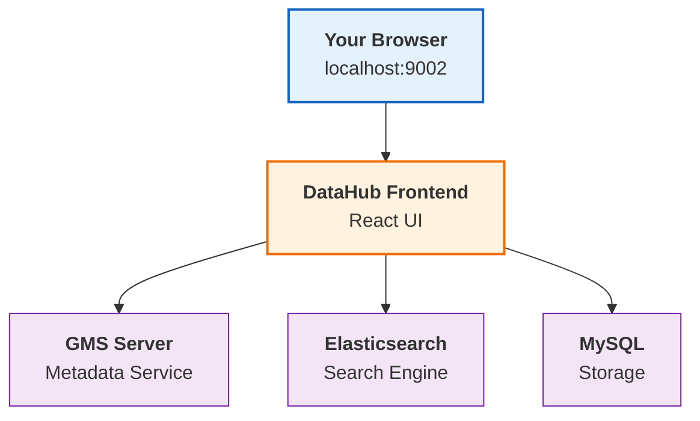

# Quick Installation ⚡

DataHub can be installed and running in a few minutes using our Docker-based setup.

## Before You Start

Let's make sure you have everything you need. Don't worry — if you've done any development work, you probably have most of these already.

### What You'll Need

| Requirement | Minimum Version | Check Command |
|-------------|-----------------|---------------|
| **Python** | 3.8+ | `python3 --version` |
| **Docker** | 20.10+ | `docker --version` |
| **Docker Compose** | 2.0+ | `docker-compose --version` |

:::tip Don't have Docker?
No worries! Download it from [docker.com](https://www.docker.com/get-started). It installs in about 2 minutes and handles all the heavy lifting for us.
:::

## The Quickest Start Ever

Ready? Here we go. Open your terminal and run these commands:

### Step 1: Install the DataHub CLI

```bash
# First, let's make sure pip is up to date
python3 -m pip install --upgrade pip wheel setuptools

# Now, install the DataHub CLI - this is your command center
python3 -m pip install --upgrade acryl-datahub
```

**What just happened?** You installed `datahub`, a powerful CLI tool that lets you control every aspect of DataHub from your terminal.

### Step 2: Launch DataHub

```bash
# Start DataHub
datahub docker quickstart
```

The initial setup will download and start all necessary DataHub services. This typically takes 3-5 minutes depending on your internet connection.

### Step 3: Open DataHub

Once you see the success message, open your browser and navigate to:

```
http://localhost:9002
```

🎉 **That's it!** You now have a fully functional DataHub instance running locally.

## First-Time Login

Use these default credentials to log in:

| Field | Value |
|-------|-------|
| **Username** | `datahub` |
| **Password** | `datahub` |

:::warning Change Your Password
If you're planning to use DataHub beyond just testing, **change this password immediately** in the settings after logging in.
:::

## What's Running Now?

Behind the scenes, DataHub has started several services for you:



## Quick Commands You'll Love

Here are some commands that'll make your life easier:

```bash
# 🛑 Stop DataHub (preserves your data)
datahub docker quickstart --stop

# 🔄 Restart DataHub
datahub docker quickstart

# 🗑️ Completely reset (WARNING: deletes all data!)
datahub docker nuke

# 📊 Check what's running
docker ps
```

## Troubleshooting Like a Pro

### "Port 9002 is already in use"

Something else is using that port. Either stop it or use a different port:

```bash
datahub docker quickstart --frontend-port 9003
```

### "Docker daemon not running"

Make sure Docker Desktop is actually running. Look for the whale icon in your system tray.

### "Out of memory"

DataHub needs at least 8GB of RAM allocated to Docker. 

**On Docker Desktop:** Settings → Resources → Memory → Set to 8GB+

### "It's taking forever"

First-time downloads can be slow. Run this to see what's happening:

```bash
docker logs datahub-frontend-react -f
```

## What's Next?

Now that DataHub is running, you're ready to:

<div className="row">
  <div className="col col--6">
    <div className="card margin-bottom--lg">
      <div className="card__header">
        <h3>📥 Ingest Your First Data</h3>
      </div>
      <div className="card__body">
        <p>Connect DataHub to your databases, warehouses, and tools.</p>
      </div>
      <div className="card__footer">
        <a className="button button--primary button--block" href="/docs/tutorial-basics/ingestion-quickstart">Start Ingesting →</a>
      </div>
    </div>
  </div>
  <div className="col col--6">
    <div className="card margin-bottom--lg">
      <div className="card__header">
        <h3>🔍 Explore the UI</h3>
      </div>
      <div className="card__body">
        <p>Take a tour of DataHub's powerful search and discovery features.</p>
      </div>
      <div className="card__footer">
        <a className="button button--primary button--block" href="/docs/tutorial-basics/ui-tour">Take the Tour →</a>
      </div>
    </div>
  </div>
</div>

---

**Need help?** Our [Slack community](https://slack.datahubproject.io) is incredibly active. Drop a question and someone will help you within minutes!
