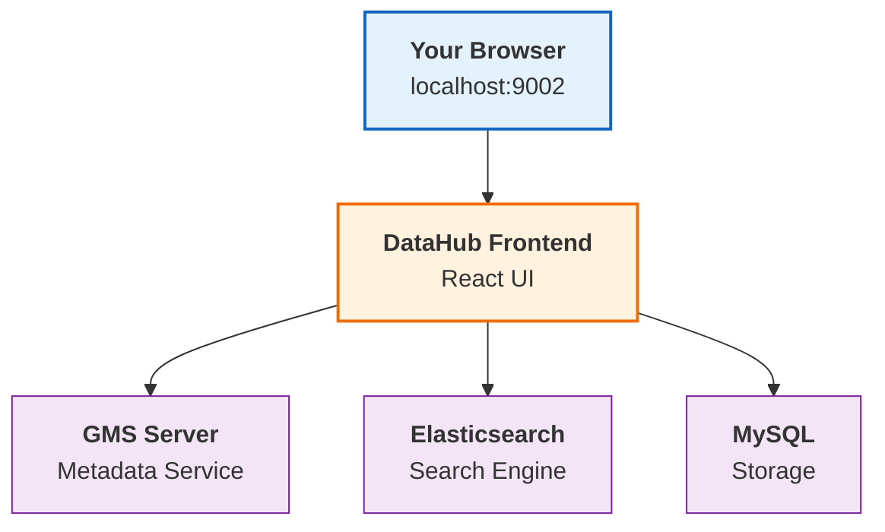

# Quick Installation

DataHub runs on Docker. If you've got Docker installed, you're about five minutes away from having it running locally.

## Before You Start

Check if you've got these installed:

| Requirement | Minimum Version | Check Command |
|-------------|-----------------|---------------|
| **Python** | 3.8+ | `python3 --version` |
| **Docker** | 20.10+ | `docker --version` |
| **Docker Compose** | 2.0+ | `docker-compose --version` |

Don't have Docker? Grab it from [docker.com](https://www.docker.com/get-started). Takes a couple minutes to install.

## Installation

Open your terminal and run these:

### Step 1: Install the DataHub CLI
```bash
python3 -m pip install --upgrade pip wheel setuptools
python3 -m pip install --upgrade acryl-datahub
```

This gives you the `datahub` command-line tool for managing everything.

### Step 2: Launch DataHub
```bash
datahub docker quickstart
```

First run downloads all the containers. Takes 3-5 minutes depending on your connection.

### Step 3: Open it

Once it's done, go to:
```
http://localhost:9002
```

That's it. You've got DataHub running.

## Login credentials

Default username and password are both `datahub`. 

Change the password after you log in if you're doing anything beyond testing. It's in the settings.

## What's actually running

DataHub spun up a few services for you:


Frontend talks to the backend services. Elasticsearch handles search. MySQL stores everything.

## Useful commands
```bash
# Stop DataHub (keeps your data)
datahub docker quickstart --stop

# Start it again
datahub docker quickstart

# Nuclear option - deletes everything
datahub docker nuke

# See what's running
docker ps
```

## When things break

### Port 9002 already in use

Something else is on that port. Kill it or use a different port:
```bash
datahub docker quickstart --frontend-port 9003
```

### Docker daemon not running

Start Docker Desktop. Look for the whale icon in your system tray.

### Out of memory errors

DataHub needs at least 8GB of RAM. Go to Docker Desktop → Settings → Resources → Memory and bump it up.

### It's stuck downloading

First-time setup downloads a bunch of images. Check what's happening:
```bash
docker logs datahub-frontend-react -f
```

If it's truly hung, stop and try again:
```bash
docker-compose down
datahub docker quickstart
```

## What's next

<div className="row">
  <div className="col col--6">
    <div className="card margin-bottom--lg">
      <div className="card__header">
        <h3>Ingest Your First Data</h3>
      </div>
      <div className="card__body">
        <p>Connect DataHub to your databases, warehouses, and tools.</p>
      </div>
      <div className="card__footer">
        <a className="button button--primary button--block" href="/docs/tutorial-basics/ingestion-quickstart">Start Ingesting →</a>
      </div>
    </div>
  </div>
  <div className="col col--6">
    <div className="card margin-bottom--lg">
      <div className="card__header">
        <h3>Explore the UI</h3>
      </div>
      <div className="card__body">
        <p>Take a tour of DataHub's search and discovery features.</p>
      </div>
      <div className="card__footer">
        <a className="button button--primary button--block" href="/docs/tutorial-basics/ui-tour">Take the Tour →</a>
      </div>
    </div>
  </div>
</div>

---

Need help? Join the [Slack community](https://slack.datahubproject.io). People usually respond pretty quick.