# Search & Discovery

The search bar is how you find things in DataHub. It's pretty straightforward - just type what you're looking for.

## Basic search

Type anything in the search bar:
```
customer orders
```

It searches across everything:
- Dataset names and descriptions
- Column names
- Dashboard titles
- Pipeline names
- Tags and glossary terms
- Owner names

You don't need the exact name. Searching "customer" will find `dim_customers`, `customer_orders`, `CustomerAnalytics`, whatever.

## Search operators

Want to be more specific? Use these:

### Exact phrases

Use quotes:
```
"customer lifetime value"
```

### Field-specific search

| Query | What It Finds |
|-------|---------------|
| `name:customers` | Datasets with "customers" in the name |
| `description:revenue` | Assets with "revenue" in the description |
| `owner:sarah` | Assets owned by Sarah |
| `tag:pii` | Assets tagged with "pii" |
| `platform:snowflake` | Only Snowflake assets |

### Boolean operators
```
customer AND orders NOT deprecated
```
```
revenue OR sales
```

### Wildcards
```
customer_*
```

Matches customer_orders, customer_profiles, whatever starts with customer_.

## Filters

Left side of the search results has filters. They're pretty useful.

**Platform**: Snowflake, PostgreSQL, dbt, Tableau, etc.

**Tags**: Filter by tags like `pii`, `deprecated`, `production`.

**Glossary Terms**: Business categories like "Revenue Metrics" or "Customer Data".

**Owners**: Find everything owned by a person or team.

**Domain**: Organizational domains like Finance, Marketing, Product.

## Advanced filters

Click "Advanced" in the filter panel for more options.

**Column-level search**: Find every table with an "email" column. Good for compliance stuff.

**Container filtering**: Find assets in a specific database or schema like `analytics.prod`.

**Combining filters**: Default is AND logic (all must match). Switch to "any filter" for OR logic.

**Negating filters**: Change the condition to "does not contain" or "is not":
```
Tag does not contain: "deprecated"
```

## How results are ranked

Results show up based on relevance:

| Factor | Impact |
|--------|--------|
| **Name match** | Highest |
| **Description match** | High |
| **Column name match** | Medium |
| **Usage frequency** | More usage = higher rank |
| **Recent updates** | Recently modified ranks higher |
| **Ownership** | Your stuff shows up higher |

### Result cards

Each result shows key info:

```mermaid
graph TD
    subgraph Card ["📊 prod.analytics.customer_orders"]
        direction TB
        Header["🏢 Snowflake  |  👤 Analytics Team  |  🏷️ production, revenue"]
        Desc["Customer order history with transaction details..."]
        Footer["📋 25 columns  |  📈 50K queries/month  |  ✅ Last updated 2h ago"]

        Header --- Desc --- Footer
    end
    style Card fill:#f5f7fa,stroke:#40a9ff,stroke-width:2px,color:#1c1e21
```


## Browsing

Sometimes you don't know what you're looking for. Just browse.

### By platform

Click Browse → Platform to see assets organized by data source:


### By domain

If your org uses domains, browse by business area:

```mermaid
graph TD
    A[🏢 Finance] --> A1[📊 Revenue tables]
    A --> A2[📈 Financial dashboards]

    B[🏢 Marketing] --> B1[📊 Campaign data]
    B --> B2[📊 Attribution models]

    C[🏢 Product] --> C1[📊 Usage metrics]
    C --> C2[📊 Feature analytics]
```


### By glossary

Navigate using business terms:


## Saved searches

Find yourself running the same search repeatedly? Save it.

1. Do your search with filters
2. Click "Save Search" (bookmark icon)
3. Name it: `PII Tables`, `My Team's Dashboards`, whatever

Access saved searches from your profile. Each one has a shareable URL you can send to teammates.

## Shortcuts and tips

**Star favorites**: Click the star on any asset. They show up on your home page.

**Keyboard shortcut**: Press `/` to jump to the search bar. `Enter` to search, `Esc` to close.

**Recently viewed**: Your home page shows what you looked at recently. Most of the time, you're looking for something you've seen before.

**Follow assets**: Click "Follow" on important stuff to get notified when it changes.

**Search in lineage**: When viewing lineage, the search bar highlights specific nodes in the graph.

## Programmatic search

Need to search from code? Use the GraphQL API:
```graphql
query searchDatasets {
  search(
    input: {
      type: DATASET
      query: "customer"
      start: 0
      count: 10
      filters: [
        { field: "platform", values: ["snowflake"] }
        { field: "tags", values: ["production"] }
      ]
    }
  ) {
    total
    searchResults {
      entity {
        urn
        ... on Dataset {
          name
          description
          platform {
            name
          }
        }
      }
    }
  }
}
```

Check the [API Reference](/docs/tutorial-extras/api-reference) for more examples.

## What's next

<div className="row">
  <div className="col col--6">
    <div className="card margin-bottom--lg">
      <div className="card__header">
        <h3>Explore Lineage</h3>
      </div>
      <div className="card__body">
        <p>See how data flows from source to dashboard.</p>
      </div>
      <div className="card__footer">
        <a className="button button--primary button--block" href="/docs/tutorial-basics/data-lineage">View Lineage →</a>
      </div>
    </div>
  </div>
  <div className="col col--6">
    <div className="card margin-bottom--lg">
      <div className="card__header">
        <h3>Organize with Tags</h3>
      </div>
      <div className="card__body">
        <p>Create tags and glossary terms for better organization.</p>
      </div>
      <div className="card__footer">
        <a className="button button--primary button--block" href="/docs/tutorial-basics/tags-glossary">Get Organized →</a>
      </div>
    </div>
  </div>
</div>