# Search & Discovery 🔍

*"Where is that customer data table?"* — If you've ever asked this question, you're going to love DataHub's search.

The search bar is the central tool for finding assets across your data estate. It provides real-time results and understands natural language queries.

### Just Start Typing

Type what you're looking for in plain English:

```
customer orders
```

DataHub will search across:
- 📊 **Dataset names** and descriptions
- 📋 **Column names** within tables
- 📈 **Dashboard titles** and chart names
- 🔧 **Pipeline names** and job descriptions
- 🏷️ **Tags** and glossary terms
- 👤 **Owner names**

:::tip Think Like Google
You don't need to know the exact name. Searching "customer" will find `dim_customers`, `customer_orders`, `CustomerAnalytics`, and anything else related.
:::

---

## Search Operators: Power User Mode

Want more control? Use these operators to refine your search:

### Exact Phrase Match

Use quotes to match an exact phrase:

```
"customer lifetime value"
```

### Field-Specific Search

Search within specific fields:

| Query | What It Finds |
|-------|---------------|
| `name:customers` | Datasets with "customers" in the name |
| `description:revenue` | Assets with "revenue" in the description |
| `owner:sarah` | Assets owned by Sarah |
| `tag:pii` | Assets tagged with "pii" |
| `platform:snowflake` | Only Snowflake assets |

### Boolean Operators

Combine terms with AND, OR, NOT:

```
customer AND orders NOT deprecated
```

```
revenue OR sales
```

### Wildcards

Use `*` for partial matches:

```
customer_*
```
*Matches: customer_orders, customer_profiles, customer_segments*

---

## The Filter Sidebar: Drill Down Fast

On the left side of search results, you'll find powerful filters:

### 📦 Platform
Filter by data source:
- Snowflake
- PostgreSQL
- dbt
- Tableau
- And 100+ more...

### 🏷️ Tags
Find assets by tags your team has applied:
- `pii`
- `deprecated`
- `production`
- `experimental`

### 📖 Glossary Terms
Business-friendly categories:
- Revenue Metrics
- Customer Data
- Marketing Attribution

### 👤 Owners
Find everything owned by a specific person or team:
- Data Engineering
- Analytics Team
- Sarah Johnson

### 🌐 Domain
Organizational domains:
- Finance
- Marketing
- Product

---

## Advanced Filters: The Full Toolkit

Click **"Advanced"** in the filter panel to unlock the full power:

### Column-Level Lineage

Column-level lineage provides a detailed view of how data flows through individual columns:

```
Column Name: "email"
```

*This finds every table with an email column — incredibly useful for compliance!*

### Container Filtering

Find assets within a specific database or schema:

```
Container: "analytics.prod"
```

### Combining Multiple Filters

By default, filters use AND logic (all must match). Click **"all filters"** to switch to **"any filter"** (OR logic).

**Example: Find PII**
```
Tag = "pii" OR Column Name contains "email" OR Column Name contains "ssn"
```

### Negating Filters

Click the condition and select **"does not contain"** or **"is not"**:

```
Tag does not contain: "deprecated"
```

---

## Understanding Search Results

### Result Ranking

Results are ranked by relevance. DataHub considers:

| Factor | Impact |
|--------|--------|
| **Name match** | Highest priority |
| **Description match** | High priority |
| **Column name match** | Medium priority |
| **Usage frequency** | Higher usage = higher ranking |
| **Recent updates** | Recently modified assets rank higher |
| **Ownership** | Assets you own appear higher |

### Result Cards

Each result shows key information at a glance:

```mermaid
graph TD
    subgraph Card ["📊 prod.analytics.customer_orders"]
        direction TB
        Header["🏢 Snowflake  |  👤 Analytics Team  |  🏷️ production, revenue"]
        Desc["Customer order history with transaction details..."]
        Footer["📋 25 columns  |  📈 50K queries/month  |  ✅ Last updated 2h ago"]

        Header --- Desc --- Footer
    end
    style Card fill:#f5f7fa,stroke:#40a9ff,stroke-width:2px,color:#1c1e21
```



---

## Browsing: When You Want to Explore

Sometimes you don't know exactly what you're looking for. That's where browsing comes in.

### Browse by Platform

Click **Browse** → **Platform** to see all assets organized by data source:

```mermaid
graph TD
    A[📦 Snowflake] --> B[📁 PROD_DB]
    B --> C[📁 analytics]
    C --> D1[📊 customer_orders]
    C --> D2[📊 revenue_summary]
    C --> D3[📊 daily_metrics]
    B --> E[📁 staging]
    A --> F[📁 RAW_DB]

    G[📦 dbt] --> H[📁 models]
    H --> I1[📊 dim_customers]
    H --> I2[📊 fct_orders]

    J[📦 Tableau] --> K[📁 Executive Dashboards]
```



### Browse by Domain

If your organization uses domains, browse by business area:

```mermaid
graph TD
    A[🏢 Finance] --> A1[📊 Revenue tables]
    A --> A2[📈 Financial dashboards]

    B[🏢 Marketing] --> B1[📊 Campaign data]
    B --> B2[📊 Attribution models]

    C[🏢 Product] --> C1[📊 Usage metrics]
    C --> C2[📊 Feature analytics]
```



### Browse by Glossary

Navigate using business terminology:

```mermaid
graph TD
    A[📖 Revenue Metrics] --> A1[ARR Annual Recurring Revenue]
    A --> A2[MRR Monthly Recurring Revenue]
    A --> A3[Churn Rate]

    B[📖 Customer Metrics] --> B1[Customer Lifetime Value]
    B --> B2[Acquisition Cost]
    B --> B3[Net Promoter Score]
```



---

## Saving Searches: Don't Repeat Yourself

Found a useful search? Save it!

### Create a Saved Search

1. Perform your search with all desired filters
2. Click **"Save Search"** (bookmark icon)
3. Give it a name: `PII Tables`, `My Team's Dashboards`, etc.

### Access Saved Searches

Click your profile → **Saved Searches** to see all your saved queries.

### Share with Your Team

Each saved search has a shareable URL. Send it to teammates and they'll see the exact same results.

---

## Pro Tips from Power Users

### 🎯 Tip 1: Star Your Favorites

Click the ⭐ star on any asset to add it to your personal list. Access them quickly from the home page.

### 🎯 Tip 2: Use the Keyboard

Press `/` anywhere to focus the search bar instantly. Press `Enter` to search, `Esc` to close.

### 🎯 Tip 3: Check "Recently Viewed"

Your home page shows recently viewed assets. 80% of the time, what you need is something you looked at before.

### 🎯 Tip 4: Follow Assets

Click **Follow** on important assets to get notifications when they change.

### 🎯 Tip 5: Search in Lineage

When viewing lineage, use the search bar within the lineage graph to highlight specific nodes.

---

## GraphQL API: Programmatic Search

Need to search from code? DataHub exposes a powerful GraphQL API:

```graphql
query searchDatasets {
  search(
    input: {
      type: DATASET
      query: "customer"
      start: 0
      count: 10
      filters: [
        { field: "platform", values: ["snowflake"] }
        { field: "tags", values: ["production"] }
      ]
    }
  ) {
    total
    searchResults {
      entity {
        urn
        ... on Dataset {
          name
          description
          platform {
            name
          }
        }
      }
    }
  }
}
```

For more API examples, see our [API Reference](/docs/tutorial-extras/api-reference).

---

## What's Next?

<div className="row">
  <div className="col col--6">
    <div className="card margin-bottom--lg">
      <div className="card__header">
        <h3>🌐 Explore Lineage</h3>
      </div>
      <div className="card__body">
        <p>See how data flows from source to dashboard.</p>
      </div>
      <div className="card__footer">
        <a className="button button--primary button--block" href="/docs/tutorial-basics/data-lineage">View Lineage →</a>
      </div>
    </div>
  </div>
  <div className="col col--6">
    <div className="card margin-bottom--lg">
      <div className="card__header">
        <h3>🏷️ Organize with Tags</h3>
      </div>
      <div className="card__body">
        <p>Create tags and glossary terms for better organization.</p>
      </div>
      <div className="card__footer">
        <a className="button button--primary button--block" href="/docs/tutorial-basics/tags-glossary">Get Organized →</a>
      </div>
    </div>
  </div>
</div>
