# Tags & Glossary

Without proper organization, your data catalog turns into a mess. "What's the difference between customer_total, cust_amt, and client_revenue?" "Is this table safe to use in production?" "Does this column contain PII?"

Tags and glossary terms fix this. Revenue metrics get tagged consistently. Production tables are marked as safe. PII columns are clearly labeled.

## The organization hierarchy

DataHub has three levels:


## Tags

Tags are simple labels. Like sticky notes.

### Creating tags

**UI**: Settings → Tags → "Create Tag". Add name, description, optional color.

**CLI**:
```bash
datahub tag create \
  --name "pii" \
  --description "Contains Personally Identifiable Information" \
  --color "#ff0000"
```

### Starter tag set

| Tag | Color | Purpose |
|-----|-------|---------|
| `production` | Green | Safe for production use |
| `deprecated` | Red | Don't use in new work |
| `pii` | Orange | Contains personal information |
| `sensitive` | Orange | Requires elevated permissions |
| `experimental` | Yellow | May change without notice |
| `golden` | Gold | Curated, trusted dataset |
| `raw` | Gray | Unprocessed source data |
| `staging` | Blue | Intermediate processing layer |

### Applying tags

**To a dataset**: Open it, click "+ Add Tag", select your tag.

**To a column**: Schema tab → click "+ Tag" next to any column.

**In bulk**:
```python
from datahub.emitter.mcp import MetadataChangeProposalWrapper
from datahub.metadata.schema_classes import GlobalTagsClass, TagAssociationClass

datasets = [
    "urn:li:dataset:(urn:li:dataPlatform:snowflake,prod.analytics.customers,PROD)",
    "urn:li:dataset:(urn:li:dataPlatform:snowflake,prod.analytics.orders,PROD)",
    "urn:li:dataset:(urn:li:dataPlatform:snowflake,prod.analytics.products,PROD)",
]

tag_urn = "urn:li:tag:production"

for dataset_urn in datasets:
    mcp = MetadataChangeProposalWrapper(
        entityUrn=dataset_urn,
        aspect=GlobalTagsClass(
            tags=[TagAssociationClass(tag=tag_urn)]
        )
    )
    emitter.emit(mcp)
```

## Glossary terms

Glossary terms are richer than tags. They have definitions, relationships, and ownership.

### Why they matter

Three teams use "Revenue" but mean different things. Sales says revenue is when a deal closes. Finance says it's recognized revenue per GAAP. Product says it's in-app purchase total.

Result: Dashboards show different numbers. Everyone's confused.

Solution: One glossary term "Revenue" with the official definition.

### Creating a glossary

**Step 1**: Create term groups to organize related terms.

```mermaid
graph TD
    subgraph "Business Glossary"
        R["📂 Revenue Metrics"]
        C["📂 Customer Metrics"]
        D["📂 Data Classifications"]
    end

    R --- R1["ARR"]
    R --- R2["MRR"]
    
    C --- C1["LTV"]
    C --- C2["Churn"]
    
    D --- D1["PII"]
    D --- D2["PHI"]
```


**Step 2**: Create terms with these fields:

| Field | Purpose | Example |
|-------|---------|---------|
| **Name** | The term | "Annual Recurring Revenue" |
| **Abbreviation** | Short form | "ARR" |
| **Definition** | What it means | "The annualized value of all recurring subscriptions..." |
| **Related Terms** | Connections | "See also: MRR, Net Revenue" |
| **Owners** | Who maintains this | "Finance Team" |
| **Source of Truth** | Authoritative dataset | "analytics.arr_summary" |

### Creating terms via UI

Govern → Glossary → "+ Create Term Group" (if needed) → "+ Create Term" → fill in the definition.


### Linking terms to data

Link terms to relevant columns and datasets. When someone hovers over a column, they see the business definition with owner info.


## Domains

Domains represent high-level organizational areas. Good for large orgs.

### When to use domains

| Scenario | Solution |
|----------|----------|
| "Marketing should own their data" | Create a **Marketing** domain |
| "Finance data needs special governance" | Create a **Finance** domain |
| "Product analytics is separate from business analytics" | Create separate domains |

### Creating domains

Govern → Domains → "+ Create Domain" → define name, description, owners.

### Domain hierarchy

Domains can be nested:

```mermaid
graph TD
    C["🏢 Company"]
    
    C --- F["📁 Finance"]
    C --- M["📁 Marketing"]
    C --- P["📁 Product"]
    
    F --- F1["📁 Revenue"]
    F --- F2["📁 Accounting"]
    
    M --- M1["📁 Campaigns"]
    M --- M2["📁 Attribution"]
```


### Assigning assets to domains
```python
from datahub.emitter.mcp import MetadataChangeProposalWrapper
from datahub.metadata.schema_classes import DomainsClass

finance_domain = "urn:li:domain:finance"

finance_datasets = [
    "urn:li:dataset:(urn:li:dataPlatform:snowflake,finance.revenue,PROD)",
    "urn:li:dataset:(urn:li:dataPlatform:snowflake,finance.billing,PROD)",
    "urn:li:dataset:(urn:li:dataPlatform:snowflake,finance.accounting,PROD)",
]

for dataset in finance_datasets:
    mcp = MetadataChangeProposalWrapper(
        entityUrn=dataset,
        aspect=DomainsClass(domains=[finance_domain])
    )
    emitter.emit(mcp)
```

## Full picture

A well-organized dataset:

```mermaid
graph TD
    D["📊 <b>customer_revenue_summary</b>"]
    
    subgraph Metadata
        Dom["🏢 Domain: Finance > Revenue"]
        Tags["🏷️ Tags: production, golden, pii"]
        Owners["👤 Owners: Revenue Analytics Team"]
    end

    subgraph Schema
        C1["customer_id (STR)"]
        C2["email (STR) | 🏷️ pii"]
        C3["arr (DEC) | 📖 ARR"]
    end

    D --- Metadata
    Metadata --- Schema

    style D fill:#e3f2fd,stroke:#1565c0,stroke-width:2px
    style Tags fill:#f1f8e9,stroke:#558b2f
```


## Automation

Don't tag everything manually. Use patterns:
```yaml
rules:
  - name: "Auto-tag PII columns"
    pattern:
      column_name:
        - "*email*"
        - "*phone*"
        - "*ssn*"
        - "*address*"
    action:
      add_tag: "pii"
  
  - name: "Auto-tag production tables"
    pattern:
      schema: "prod.*"
    action:
      add_tag: "production"
  
  - name: "Assign finance domain"
    pattern:
      database: "finance"
    action:
      set_domain: "finance"
```

### Inheriting from dbt

Tags and descriptions sync automatically from dbt:
```yaml
models:
  - name: customer_revenue
    description: "Aggregated customer revenue metrics"
    meta:
      datahub:
        domain: finance
        tags:
          - production
          - golden
    columns:
      - name: arr
        description: "Annual Recurring Revenue"
        meta:
          datahub:
            glossary_terms:
              - "urn:li:glossaryTerm:annual_recurring_revenue"
```

## Don't screw this up

**Start with a core vocabulary**: Before creating terms, get stakeholders aligned. List the 20 most important business terms. Get 3-4 key people to agree on definitions. Document in DataHub.

**Assign clear ownership**: Every term and domain needs an owner. "Owned by Everyone" means nobody owns it. "Owned by Finance Data Team, contact: @sarah" is better.

**Keep tags simple**: Don't create pii, personal, sensitive, confidential, private, and secret. Just use pii for personal data and sensitive for business-sensitive data.

**Review regularly**: Schedule quarterly reviews. Are terms still accurate? Are there new concepts to add? Are deprecated terms cleaned up?

## What's next

<div className="row">
  <div className="col col--6">
    <div className="card margin-bottom--lg">
      <div className="card__header">
        <h3>Access Control</h3>
      </div>
      <div className="card__body">
        <p>Implement fine-grained permissions.</p>
      </div>
      <div className="card__footer">
        <a className="button button--primary button--block" href="/docs/tutorial-basics/governance">Set Up Access →</a>
      </div>
    </div>
  </div>
  <div className="col col--6">
    <div className="card margin-bottom--lg">
      <div className="card__header">
        <h3>Integrations</h3>
      </div>
      <div className="card__body">
        <p>Connect more data sources.</p>
      </div>
      <div className="card__footer">
        <a className="button button--primary button--block" href="/docs/tutorial-extras/integrations">Explore Integrations →</a>
      </div>
    </div>
  </div>
</div>