```mermaid
graph TD
    subgraph "Business Glossary"
        R["📂 Revenue Metrics"]
        C["📂 Customer Metrics"]
        D["📂 Data Classifications"]
    end

    R --- R1["ARR"]
    R --- R2["MRR"]
    
    C --- C1["LTV"]
    C --- C2["Churn"]
    
    D --- D1["PII"]
    D --- D2["PHI"]
```

```mermaid
graph TD
    D["📊 <b>customer_revenue_summary</b>"]
    
    subgraph Metadata
        Dom["🏢 Domain: Finance > Revenue"]
        Tags["🏷️ Tags: production, golden, pii"]
        Owners["👤 Owners: Revenue Analytics Team"]
    end

    subgraph Schema
        C1["customer_id (STR)"]
        C2["email (STR) | 🏷️ pii"]
        C3["arr (DEC) | 📖 ARR"]
    end

    D --- Metadata
    Metadata --- Schema

    style D fill:#e3f2fd,stroke:#1565c0,stroke-width:2px
    style Tags fill:#f1f8e9,stroke:#558b2f
```

# Tags & Glossary 🏷️

*"What does this column actually mean?"* — Let's make sure everyone speaks the same data language.

## The Organization Problem

Without proper organization, your data catalog becomes a junkyard:

```
❌ Before Tags & Glossary:
   "What's the difference between customer_total, cust_amt, and client_revenue?"
   "Is this table safe to use in production?"
   "Does this column contain PII?"
```

```
✅ After Tags & Glossary:
   All revenue metrics → Tagged with "Revenue Metrics" glossary term
   Production tables → Tagged with ✅ "production"
   PII columns → Tagged with 🔒 "pii" 
```

---

## Understanding the Hierarchy

DataHub provides three levels of organization:


---

## Tags: Quick Labels

Tags are the simplest way to categorize your data. Think of them as sticky notes.

### Creating Tags

#### Via UI

1. Go to **Settings** → **Tags**
2. Click **"Create Tag"**
3. Add name, description, and optional color


#### Via CLI

```bash
datahub tag create \
  --name "pii" \
  --description "Contains Personally Identifiable Information" \
  --color "#ff0000"
```

### Recommended Tag Set

Here's a battle-tested set of tags to start with:

| Tag | Color | Purpose |
|-----|-------|---------|
| `production` | 🟢 Green | Safe for production use |
| `deprecated` | 🔴 Red | Should not be used in new work |
| `pii` | 🟠 Orange | Contains personal information |
| `sensitive` | 🟠 Orange | Requires elevated permissions |
| `experimental` | 🟡 Yellow | May change without notice |
| `golden` | ⭐ Gold | Curated, trusted dataset |
| `raw` | ⚪ Gray | Unprocessed source data |
| `staging` | 🔵 Blue | Intermediate processing layer |

### Applying Tags

#### To a Dataset

1. Open the dataset
2. Click **"+ Add Tag"** in the header
3. Search and select your tag

#### To a Column

1. Open the dataset's **Schema** tab
2. Click the **"+ Tag"** button next to any column
3. Select the tag

#### In Bulk (via API)

```python
from datahub.emitter.mcp import MetadataChangeProposalWrapper
from datahub.metadata.schema_classes import GlobalTagsClass, TagAssociationClass

# Apply tags to multiple datasets
datasets = [
    "urn:li:dataset:(urn:li:dataPlatform:snowflake,prod.analytics.customers,PROD)",
    "urn:li:dataset:(urn:li:dataPlatform:snowflake,prod.analytics.orders,PROD)",
    "urn:li:dataset:(urn:li:dataPlatform:snowflake,prod.analytics.products,PROD)",
]

tag_urn = "urn:li:tag:production"

for dataset_urn in datasets:
    mcp = MetadataChangeProposalWrapper(
        entityUrn=dataset_urn,
        aspect=GlobalTagsClass(
            tags=[TagAssociationClass(tag=tag_urn)]
        )
    )
    emitter.emit(mcp)
```

---

## Glossary Terms: Business Definitions

Glossary terms are richer than tags. They include definitions, relationships, and ownership.

### Why Glossary Terms Matter

```
Scenario: Three teams use the word "Revenue"

Team A (Sales): Revenue = Deal closed amount
Team B (Finance): Revenue = Recognized revenue per GAAP
Team C (Product): Revenue = In-app purchase total

Result: Dashboards show different numbers, everyone is confused!

Solution: Create one glossary term "Revenue" with THE official definition
```

### Creating a Glossary

#### Step 1: Create Term Groups

Term groups organize related terms:



#### Step 2: Create Terms

For each term, define:

| Field | Purpose | Example |
|-------|---------|---------|
| **Name** | The term | "Annual Recurring Revenue" |
| **Abbreviation** | Short form | "ARR" |
| **Definition** | What it means | "The annualized value of all recurring subscriptions..." |
| **Related Terms** | Connections | "See also: MRR, Net Revenue" |
| **Owners** | Who maintains this | "Finance Team" |
| **Source of Truth** | Authoritative dataset | "analytics.arr_summary" |

### Creating Terms via UI

1. Go to **Govern** → **Glossary**
2. Click **"+ Create Term Group"** (if needed)
3. Click **"+ Create Term"**
4. Fill in the definition


### Linking Terms to Data

Once a term exists, link it to relevant columns and datasets:

```mermaid
graph TD
    subgraph Dataset ["📊 analytics.revenue_summary"]
        direction LR
    end
    style Dataset fill:#f5f7fa,stroke:#40a9ff,stroke-width:2px,color:#1c1e21
```



```

Now when someone hovers over the column, they see:

```mermaid
graph TD
    H["<b>arr (DECIMAL)</b>"]
    H --- T["📖 Annual Recurring Revenue (ARR)"]
    T --- Def["The annualized value of all active recurring..."]
    Def --- Metadata["Owner: Finance Team | Related: MRR, Net Revenue"]

    style H fill:#e3f2fd,stroke:#1565c0,stroke-width:2px
    style T fill:#f9f9f9
```



---

## Domains: Business Ownership

Domains represent high-level organizational areas. They're perfect for large organizations.

### When to Use Domains

| Scenario | Solution |
|----------|----------|
| "Marketing should own their data" | Create a **Marketing** domain |
| "Finance data needs special governance" | Create a **Finance** domain |
| "Product analytics is separate from business analytics" | Create separate domains |

### Creating Domains

1. Go to **Govern** → **Domains**
2. Click **"+ Create Domain"**
3. Define name, description, and owners


### Domain Hierarchy

Domains can be nested:

```mermaid
graph TD
    C["🏢 Company"]
    
    C --- F["📁 Finance"]
    C --- M["📁 Marketing"]
    C --- P["📁 Product"]
    
    F --- F1["📁 Revenue"]
    F --- F2["📁 Accounting"]
    
    M --- M1["📁 Campaigns"]
    M --- M2["📁 Attribution"]
```



### Assigning Assets to Domains

```python
# Bulk assign datasets to a domain
from datahub.emitter.mcp import MetadataChangeProposalWrapper
from datahub.metadata.schema_classes import DomainsClass

finance_domain = "urn:li:domain:finance"

finance_datasets = [
    "urn:li:dataset:(urn:li:dataPlatform:snowflake,finance.revenue,PROD)",
    "urn:li:dataset:(urn:li:dataPlatform:snowflake,finance.billing,PROD)",
    "urn:li:dataset:(urn:li:dataPlatform:snowflake,finance.accounting,PROD)",
]

for dataset in finance_datasets:
    mcp = MetadataChangeProposalWrapper(
        entityUrn=dataset,
        aspect=DomainsClass(domains=[finance_domain])
    )
    emitter.emit(mcp)
```

---

## Putting It All Together

Here's how a well-organized dataset looks:



---

## Automation: Propagating Organization

Don't tag everything manually! Use automation:

### Auto-Tagging Based on Patterns

```yaml
# classification_rules.yml
rules:
  - name: "Auto-tag PII columns"
    pattern:
      column_name:
        - "*email*"
        - "*phone*"
        - "*ssn*"
        - "*address*"
    action:
      add_tag: "pii"
  
  - name: "Auto-tag production tables"
    pattern:
      schema: "prod.*"
    action:
      add_tag: "production"
  
  - name: "Assign finance domain"
    pattern:
      database: "finance"
    action:
      set_domain: "finance"
```

### Inheriting from dbt

If you use dbt, tags and descriptions sync automatically:

```yaml
# schema.yml in dbt
models:
  - name: customer_revenue
    description: "Aggregated customer revenue metrics"
    meta:
      datahub:
        domain: finance
        tags:
          - production
          - golden
    columns:
      - name: arr
        description: "Annual Recurring Revenue"
        meta:
          datahub:
            glossary_terms:
              - "urn:li:glossaryTerm:annual_recurring_revenue"
```

---

## Best Practices

### ✅ Start with a Core Vocabulary

Before creating terms, get stakeholders aligned:

1. List the 20 most important business terms
2. Get 3-4 key people to agree on definitions
3. Document in DataHub

### ✅ Assign Clear Ownership

Every term and domain should have an owner:

```
❌ Wrong: "Owned by Everyone" (means nobody)
✅ Right: "Owned by Finance Data Team, contact: @sarah"
```

### ✅ Keep Tags Simple

```
❌ Too many tags: pii, personal, sensitive, confidential, private, secret
✅ Simple: pii (for personal data), sensitive (for business sensitive)
```

### ✅ Review Regularly

Schedule quarterly reviews:
- Are terms still accurate?
- Are there new concepts to add?
- Are deprecated terms cleaned up?

---

## What's Next?

<div className="row">
  <div className="col col--6">
    <div className="card margin-bottom--lg">
      <div className="card__header">
        <h3>🔐 Access Control</h3>
      </div>
      <div className="card__body">
        <p>Implement fine-grained permissions.</p>
      </div>
      <div className="card__footer">
        <a className="button button--primary button--block" href="/docs/tutorial-basics/governance">Set Up Access →</a>
      </div>
    </div>
  </div>
  <div className="col col--6">
    <div className="card margin-bottom--lg">
      <div className="card__header">
        <h3>🔌 Integrations</h3>
      </div>
      <div className="card__body">
        <p>Connect more data sources.</p>
      </div>
      <div className="card__footer">
        <a className="button button--primary button--block" href="/docs/tutorial-extras/integrations">Explore Integrations →</a>
      </div>
    </div>
  </div>
</div>
