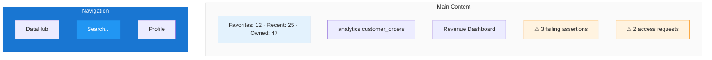
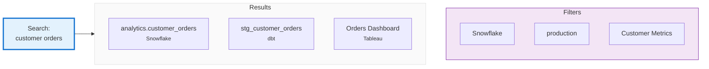
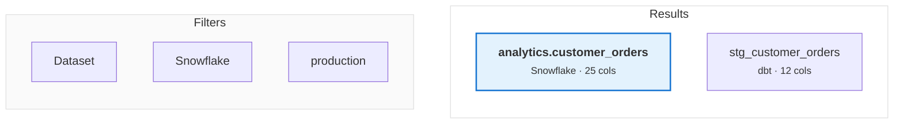
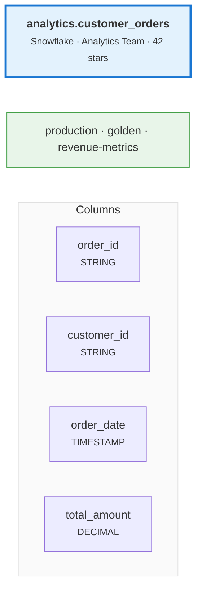
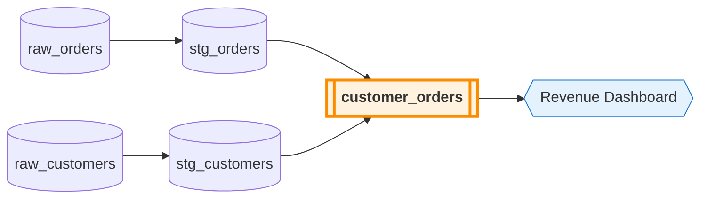
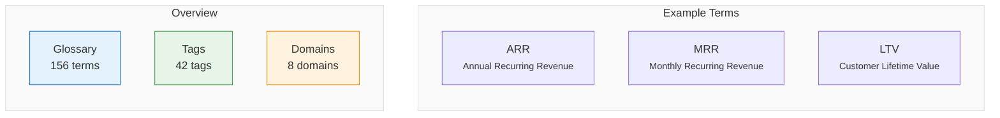
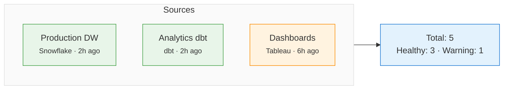
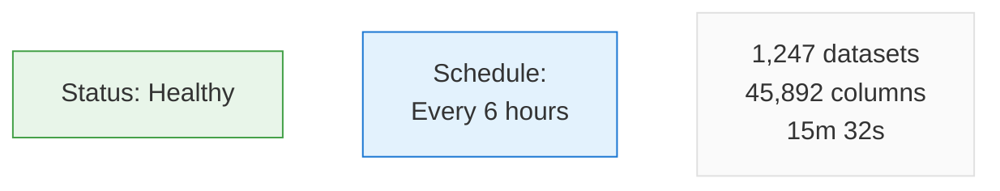

# DataHub UI Tour

Quick tour of the interface and where things are.

## Home page

When you log in, you see your personalized home:

**Search Bar**: Find anything instantly.

**Favorites**: Quick access to starred assets.

**Recently Viewed**: Jump back to what you were looking at.

**Needs Attention**: Action items that need you.

## Search

Click the search bar or press `/` to search:

Full results page:

## Dataset page

Click any dataset to see its profile:

### Tabs

| Tab | What's There |
|-----|--------------|
| **Schema** | Columns, types, descriptions, tags |
| **Lineage** | Visual graph of data flow |
| **Documentation** | Long-form docs (markdown supported) |
| **Quality** | Assertions, freshness, health status |
| **Queries** | Sample queries and usage stats |
| **History** | Changelog and audit trail |
| **Settings** | Advanced config |

## Lineage view

Most useful visualization:

### Controls

| Control | What It Does |
|---------|--------------|
| **Upstream/Downstream** | Direction to explore |
| **Hops** | How many levels to show (1-5) |
| **Entity Type** | Filter by datasets, dashboards, etc. |
| **Column Level** | Switch to column-level lineage |

## Governance center

Manage classifications, terms, and domains:

## Ingestion center

Manage data source connections and check their status:

Click any source for details:

## Keyboard shortcuts

| Shortcut | Action |
|----------|--------|
| `/` | Focus search bar |
| `Esc` | Close modal/dropdown |
| `g` then `h` | Go to home |
| `g` then `s` | Go to settings |
| `g` then `g` | Go to glossary |
| `?` | Show all shortcuts |

## Dark mode

Click your profile avatar (top right) → Toggle "Dark Mode". Switches immediately.

## Mobile

Works on phones. You can search, browse datasets, view lineage (simplified), approve access requests, and get notifications. Complex editing is better on desktop though.

## Customization

**Personal**:
- Home page widgets - drag and arrange
- Default filters - set remembered search filters
- Notification preferences - choose what alerts you
- Starred assets - pin important datasets

**Team settings** (admins):
- Company logo
- Color theme
- Default domain views
- Welcome messages

## Tips

**Browser extension**: Install the DataHub extension to see metadata when viewing queries in your SQL client.

**Bookmark with context**: When you share a DataHub link, it preserves your current view (tab, lineage depth, filters).

**Quick copy**: `Ctrl+C` / `Cmd+C` on any asset copies its URN to clipboard. Useful for API calls.

**Fullscreen lineage**: Press `F` when viewing lineage to go fullscreen. Good for presentations.

## What's next

  

    

      

        <h3>Start Ingesting</h3>
      

      

        
Connect your first data source.

      

      

        <a className="button button--primary button--block" href="/docs/tutorial-basics/ingestion-quickstart">Ingest Data →</a>
      

    

  

  

    

      

        <h3>Search Your Data</h3>
      

      

        
Find datasets using search.

      

      

        <a className="button button--primary button--block" href="/docs/tutorial-basics/search-discovery">Master Search →</a>
      

    

  

