# DataHub UI Tour 🎨

Explore the DataHub interface and its core navigation components.

## The Home Page

When you first log in, you'll see your personalized home:

```mermaid
graph TD
    subgraph Header
        Logo["🏠 DataHub"] --- Search["🔍 Search..."] --- User["👤 You"]
    end

    subgraph "Welcome Section"
        Greeting["Good morning, Alex! 👋"]
        
        Stats["📈 <b>Your Data at a Glance</b><br/>⭐ Favorites: 12 | 🕐 Recent: 25 | 📊 Owned: 47"]
    end

    subgraph "Recently Viewed"
        R1["📊 analytics.customer_orders (5m ago)"]
        R2["📈 Revenue Dashboard (1h ago)"]
        R3["📊 marketing.campaigns (2h ago)"]
    end

    subgraph "Needs Attention"
        A1["⚠️ 3 datasets have failing assertions"]
        A2["⚠️ 2 pending access requests"]
    end

    Header --- Welcome
    Welcome --- Recently
    Recently --- Needs

    style Greeting fill:#fff,stroke:none,font-size:1.2em
    style Stats fill:#e3f2fd,stroke:#1565c0,stroke-width:2px
    style A1 fill:#fff3e0,stroke:#ef6c00
    style A2 fill:#fff3e0,stroke:#ef6c00
```

### Key Elements

| Element | Purpose |
|---------|---------|
| **Search Bar** | Find any asset instantly |
| **Favorites** | Quick access to starred assets |
| **Recently Viewed** | Jump back to what you were working on |
| **Needs Attention** | Action items requiring your response |

---

## The Search Experience

### Global Search Bar

Click the search bar (or press `/`) to start searching:

```mermaid
graph TD
    S["🔍 <b>customer orders</b>"]
    
    subgraph "Quick Results"
        Q1["📊 analytics.customer_orders | Snowflake"]
        Q2["📊 staging.stg_customer_orders | dbt"]
        Q3["📈 Customer Orders Dashboard | Tableau"]
    end

    subgraph "Suggested Filters"
        F1["📦 Platform: Snowflake"]
        F2["🏷️ Tag: production"]
        F3["📖 Glossary: Customer Metrics"]
    end

    S --- Quick
    Quick --- Filters
```

### Search Results Page

Full results with filters on the left:

```mermaid
graph LR
    subgraph Filters
        direction TB
        F1["☑ Dataset"]
        F2["☐ Dashboard"]
        F3["☑ Snowflake"]
        F4["☑ production"]
    end

    subgraph Results
        direction TB
        R1["📊 <b>analytics.customer_orders</b><br/>Snowflake • 25 columns • ⭐ Golden"]
        R2["📊 <b>staging.stg_customer_orders</b><br/>dbt • 12 columns"]
        R3["📈 <b>Customer Orders Dashboard</b><br/>Tableau • 5 charts"]
    end

    Filters --- Results
    
    style R1 fill:#e3f2fd,stroke:#1565c0
    style R2 fill:#f9f9f9
    style R3 fill:#f9f9f9
```

---

## The Dataset Page

Click any dataset to see its full profile:

```mermaid
graph TD
    subgraph Header
        Title["📊 <b>analytics.customer_orders</b><br/>❄️ Snowflake | 👤 Analytics Team | ⭐ 42 stars"]
        Tags["🏷️ production | 🏷️ golden | 🏷️ revenue-metrics"]
    end

    subgraph "Schema Preview"
        direction TB
        C1["order_id (STRING)"]
        C2["customer_id (STRING)"]
        C3["order_date (TIMESTAMP)"]
        C4["total_amount (DECIMAL) | 📖 Order Total"]
    end

    Header --- Preview
    
    style Title fill:#e3f2fd,stroke:#1565c0,stroke-width:2px
    style Tags fill:#f1f8e9,stroke:#558b2f
```

### Tabs Explained

| Tab | What You'll Find |
|-----|------------------|
| **Schema** | Columns, types, descriptions, and tags |
| **Lineage** | Visual graph of data flow |
| **Documentation** | Long-form documentation (markdown supported) |
| **Quality** | Assertions, freshness, and health status |
| **Queries** | Sample queries and usage statistics |
| **History** | Changelog and audit trail |
| **Settings** | Advanced configuration |

---

## The Lineage View

The most powerful visualization in DataHub:

### Lineage Controls

| Control | What It Does |
|---------|--------------|
| **Upstream/Downstream** | Direction to explore |
| **Hops** | How many levels to show (1-5) |
| **Entity Type** | Filter by datasets, dashboards, etc. |
| **Column Level** | Switch to column-level lineage |

---

## Governance Center

Manage classifications, terms, and domains from a central location:

```mermaid
graph TD
    subgraph "Governance Overview"
        direction LR
        G1["📖 <b>Glossary</b><br/>156 terms"]
        G2["🏷️ <b>Tags</b><br/>42 tags"]
        G3["🏢 <b>Domains</b><br/>8 domains"]
    end

    subgraph "Business Glossary Preview"
        direction TB
        T1["📂 <b>Revenue Metrics</b>"]
        T1.1["ARR (Annual Recurring Revenue)"]
        T1.2["MRR (Monthly Recurring Revenue)"]
        
        T2["📂 <b>Customer Metrics</b>"]
        T2.1["Customer Lifetime Value"]
        T2.2["Churn Rate"]
    end

    Governance --- Glossary
    
    style G1 fill:#e3f2fd,stroke:#1565c0
    style G2 fill:#f1f8e9,stroke:#558b2f
    style G3 fill:#fff3e0,stroke:#ef6c00
```

---

## Ingestion Center

Manage all your data source connections and monitor their status:

```mermaid
graph TD
    S1["Production DW | ❄️ Snowflake | ✅ Pass | 2h ago"]
    S2["Analytics dbt | 🏗️ dbt | ✅ Pass | 2h ago"]
    S3["Dashboards | 📊 Tableau | ⚠️ Warn | 6h ago"]
    S4["Event Stream | 📡 Kafka | ✅ Pass | 30m ago"]

    subgraph "Ingestion Summary"
        Total["Total: 5 | Healthy: 3 | Warning: 1 | Failed: 1"]
    end

    S1 --- Total
    S2 --- Total
    S3 --- Total
    S4 --- Total

    style S1 stroke:#2e7d32
    style S2 stroke:#2e7d32
    style S3 stroke:#ef6c00
    style S4 stroke:#2e7d32
    style Total fill:#e3f2fd,stroke:#1565c0
```

### Source Details

Click any source to see details:

---

## Keyboard Shortcuts

Speed up your workflow:

| Shortcut | Action |
|----------|--------|
| `/` | Focus search bar |
| `Esc` | Close modal/dropdown |
| `g` then `h` | Go to home |
| `g` then `s` | Go to settings |
| `g` then `g` | Go to glossary |
| `?` | Show all shortcuts |

---

## Dark Mode

DataHub supports dark mode for a better viewing experience in low-light environments:

1. Click your **profile avatar** (top right)
2. Toggle **"Dark Mode"**
3. The interface will switch to the dark theme immediately.

---

## Mobile Experience

DataHub is responsive! Access from your phone:

- ✅ Search and browse datasets
- ✅ View lineage (simplified view)
- ✅ Approve access requests
- ✅ Get notifications
- ⚠️ Complex editing works better on desktop

---

## Customizing Your Experience

### Personalization Options

1. **Home Page Widgets** - Drag and arrange widgets
2. **Default Filters** - Set remembered search filters
3. **Notification Preferences** - Choose what alerts you
4. **Starred Assets** - Pin important datasets

### Team Settings

Admins can customize:
- Company logo
- Color theme
- Default domain views
- Welcome messages

---

## Pro Tips

### 🎯 Tip 1: Use the Browser Extension

Install the DataHub browser extension to see metadata when viewing queries in your SQL client.

### 🎯 Tip 2: Bookmark with Context

When you share a DataHub link, it preserves your current view (tab, lineage depth, filters).

### 🎯 Tip 3: Quick Copy

`Ctrl+C` / `Cmd+C` on any asset copies its URN to clipboard — useful for API calls.

### 🎯 Tip 4: Fullscreen Lineage

Press `F` when viewing lineage to go fullscreen — great for presentations.

---

## You're Ready!

You now know your way around DataHub. Time to put it to use:

  

    

      

        <h3>📥 Start Ingesting</h3>
      

      

        
Connect your first data source.

      

      

        <a className="button button--primary button--block" href="/docs/tutorial-basics/ingestion-quickstart">Ingest Data →</a>
      

    

  

  

    

      

        <h3>🔍 Search Your Data</h3>
      

      

        
Find datasets using powerful search.

      

      

        <a className="button button--primary button--block" href="/docs/tutorial-basics/search-discovery">Master Search →</a>
      

    

  

