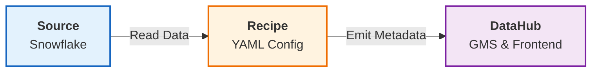

# Integrations 🔌

DataHub plays nice with your entire stack. We support **50+ integrations** out of the box.

## The Big Three

Most DataHub deployments start here.

### ❄️ Snowflake

**What we capture:**
- Tables, Views, Columns, Schemas
- Usage logs (Queries)
- Access history (Lineage)
- Tags and descriptions

**Quick Config:**
```yaml
source:
  type: snowflake
  config:
    account_id: your-account
    username: datahub_user
    password: ${SNOWFLAKE_PASSWORD}
    role: ACCOUNTADMIN
    warehouse: COMPUTE_WH
    include_table_lineage: true
    include_column_lineage: true
```

### 🏗️ dbt (Core & Cloud)

**What we capture:**
- Models, Seeds, Sources, Tests
- Documentation & Descriptions
- Lineage (Model → Model)
- Tags and Owners

**Quick Config:**
```yaml
source:
  type: dbt
  config:
    manifest_path: "./target/manifest.json"
    catalog_path: "./target/catalog.json"
    target_platform: snowflake # links dbt models to snowflake tables
```

### 📊 Tableau / Looker / PowerBI

**What we capture:**
- Dashboards, Sheets, Charts
- Data Sources/Extracts
- Lineage (Table → Dashboard)
- Owners

**Quick Config (Tableau):**
```yaml
source:
  type: tableau
  config:
    connect_uri: "https://10az.online.tableau.com"
    username: admin@company.com
    password: ${TABLEAU_PASSWORD}
    site: my-site
```

---

## Complete Integration List

### Databases & Warehouses
- AWS Athena
- AWS Redshift
- Azure SQL
- BigQuery
- ClickHouse
- Databricks
- Hive / Hadoop
- MongoDB
- MySQL / MariaDB
- Oracle
- PostgreSQL
- SQL Server
- Teradata
- Vertica

### Orchestration & Pipelines
- Airflow
- Dagster
- Glue
- Nifi
- Prefect
- Spark

### BI & Visualization
- Looker
- Metabase
- Mode
- PowerBI
- Qlik Sense
- Redash
- Superset
- Tableau

### Messaging & Streaming
- Kafka
- Pulsar
- Kinesis

### ML & AI
- SageMaker
- MLflow
- Feast

---

## How Ingestion Works

DataHub uses a pull-based mechanism (mostly) called "Recipes".



1. **Recipe:** You define *what* to pull and *how* (credentials, filters).
2. **Execution:** The DataHub CLI runs the recipe.
3. **MCE:** Metadata Change Events are emitted to DataHub.

### Running a Recipe

```bash
# 1. Install plugin
pip install "acryl-datahub[snowflake]"

# 2. Run ingestion
datahub ingest -c my_recipe.yml
```

---

## Real-Time Lineage (Push-Based)

For some tools like Airflow or Spark, pulling isn't enough. We need real-time data.

### Airflow Integration

We use `OpenLineage` or our native plugin to push metadata as DAGs run.

**Installation:**
```bash
pip install acryl-datahub-airflow-plugin
```

**Configuration (airflow.cfg):**
```ini
[lineage]
backend = datahub_provider.lineage.datahub.DatahubLineageBackend
datahub_kwargs = {
    "datahub_conn_id": "datahub_rest_default",
    "capture_executions": True
}
```

Now, every time a DAG task finishes, DataHub knows immediately.

---

## Custom Integrations

Don't see your tool? Build your own!

### 1. Simple: CSV Ingestion

If you have metadata in a spreadsheet, just map it.

```yaml
source:
  type: csv
  config:
    path: ./my_metadata.csv
    # Mapping config...
```

### 2. Advanced: Python SDK

Write a script to push any metadata.

```python
# See API Reference for details
emitter.emit_mcp(entity_urn, aspect)
```

---

## Hosting Ingestion

You don't want to run `datahub ingest` from your laptop forever.

### Option 1: DataHub UI (Managed)
Go to **Ingest** tab in UI, paste your recipe, and schedule it. (Requires distributed executor setup).

### Option 2: Airflow
Create a DAG that runs datahub ingestion tasks.

### Option 3: GitHub Actions
Run ingestion on schema change commits.

---

## Best Practices

### 🔒 Credential Management
Never commit passwords. Use environment variables `${ENV_VAR}` in your recipes.

### ⏱️ Scheduling
- **Warehouses:** Run daily or every 6 hours.
- **dbt:** Run immediately after dbt jobs finish (part of same pipeline).
- **BI:** Daily is usually sufficient.

### 🎯 Filtering
Don't ingest `TEMP_*` or `SANDBOX_*` schemas. Use patterns:

```yaml
config:
  schema_pattern:
    deny:
      - ".*TEMP.*"
      - ".*SANDBOX.*"
```

---

## What's Next?

<div className="row">
  <div className="col col--6">
    <div className="card margin-bottom--lg">
      <div className="card__header">
        <h3>Production</h3>
      </div>
      <div className="card__body">
        <p>Prepare for high-scale deployment.</p>
      </div>
      <div className="card__footer">
        <a className="button button--primary button--block" href="/docs/tutorial-extras/production-deployment">Deploy to Prod →</a>
      </div>
    </div>
  </div>
</div>
